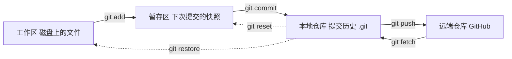

# 从这个仓库学 Git：真实执行过的命令逐条详解

> 面向完全没接触过 Git 的读者。本文的每条命令都是在本仓库（`Za7Za8`）里**真实执行过**的，
> 按实际发生的顺序组织，**每条只出现一次**（需要别处用到时用交叉引用，不重复罗列）。
>
> 相关的另外两份文件：提交规范见 [`../AGENTS.md`](../AGENTS.md)，脚本用法见 [`../README.md`](../README.md)。

## 目录

- [0. 先建立模型：Git 里到底有哪几个"地方"](#0-先建立模型git-里到底有哪几个地方)
- [1. 确认环境与创建仓库](#1-确认环境与创建仓库)
- [2. 看状态：我到底改了什么](#2-看状态我到底改了什么)
- [3. 暂存与提交](#3-暂存与提交)
- [4. 看历史](#4-看历史)
- [5. 撤销、暂存与"后悔药"](#5-撤销暂存与后悔药)
- [6. 远端：连接与推送](#6-远端连接与推送)
- [7. 整理历史](#7-整理历史)
- [8. 认证与网络](#8-认证与网络)
- [9. 本仓库真实踩过的坑](#9-本仓库真实踩过的坑)
- [10. 速查表](#10-速查表)

---

## 0. 先建立模型：Git 里到底有哪几个"地方"

不先把这张图记住，后面的命令全是死记硬背。



| 名字 | 是什么 | 在本仓库里 |
|---|---|---|
| **工作区**（working tree） | 你在编辑器里看到、能直接改的文件 | `C:\Users\12724\Desktop\others\` 下的那些文件 |
| **暂存区**（index / staging area） | 一份"下次提交要包含什么"的快照，藏在 `.git/` 里 | `git add` 就是往这里放 |
| **本地仓库**（.git） | 所有提交构成的历史 | `.git/` 目录 |
| **远端**（remote） | 另一处的仓库副本，通常叫 `origin` | `github.com:PandPirate/Za7Za8.git` |

再记住三个词：

- **提交（commit）**：一次快照 + 元信息（信息、作者、时间、父提交）。提交用一串 40 位十六进制数标识，
  简称时只写前 7 位，比如 `353d7cb`。
- **分支（branch）**：一个**可以移动的指针**，指向某个提交。本仓库用的分支名是 `master`。
  提交时指针自动前移——这就是"在分支上提交"。
- **HEAD**：表示"我现在在哪儿"，通常指向某个分支（比如 `HEAD -> master`）。

> 关键理解：`git add`/`commit`/`reset` 这些操作，本质是在**搬动这几个区域里的内容**和**移动指针**。
> 搞不清某个命令在干什么时，回到上面那张图问一句：它动的是哪两个框？

---

## 1. 确认环境与创建仓库

### `git --version`

看装的是哪个版本。本项目：

```
git version 2.44.0.windows.1
```

版本决定了有哪些新命令可用（比如 `git restore` 需要 2.23 以上）。

### `git rev-parse --show-toplevel`

问 Git"当前目录属于哪个仓库的根目录"。本项目最初执行时返回：

```
fatal: not a git repository (or any of the parent directories): .git
```

—— 这就是"还没建仓库"。这条命令最大的价值是**先确认自己站在哪儿**，避免在错误的目录里乱敲命令。

它的兄弟 `git rev-parse --git-dir` 在本仓库返回 `.git`，即仓库元数据目录的位置。

### `git init`

在当前位置创建一个空仓库。

```
git init
# Initialized empty Git repository in C:/Users/12724/Desktop/others/.git/
```

只做三件事：建 `.git/` 目录、生成默认配置、**不碰你的任何文件**。所以它是安全的。
本项目就是在 `others/` 下执行的，于是这个目录成了仓库根。

### `git symbolic-ref --short HEAD`

问"我现在在哪个分支"。本项目返回：

```
master
```

之所以用 `symbolic-ref` 而不是 `git branch`：在**还没有任何提交**时，`git branch` 一个都不显示
（分支是"指向提交的指针"，没有提交就没有分支可指），而 `HEAD` 其实已经名义上指向 `master` 了。
一个空仓库里想确认分支名，这条最可靠。

### `git config --get <键>`

读一条配置。本仓库实际读过这些：

```bash
git config --get user.name          # pandapirate
git config --get user.email         # 1272403707@qq.com
git config --get credential.helper  # manager
git config --get init.defaultBranch # master
```

| 键 | 作用 |
|---|---|
| `user.name` / `user.email` | 每次提交会写进提交记录，代表"谁提交的"。**没配置的话 `git commit` 会直接拒绝** |
| `credential.helper` | 用什么程序保存账号密码/令牌。`manager` 指 Git Credential Manager（Windows 上常见） |
| `init.defaultBranch` | `git init` 时新分支叫什么名字。这里是 `master`（GitHub 新建仓库默认是 `main`，两者不一致会带来后面第 6 节的麻烦） |

### `git config --list --show-origin`

列出所有配置，**并注明每条来自哪个文件**。本项目输出里能看到：

```
file:C:/Program Files/Git/etc/gitconfig   credential.helper=manager
```

即"这条是 Git 安装时的系统级配置"。Git 配置分三层，优先级从低到高：

```
系统级 C:/Program Files/Git/etc/gitconfig   ← 所有用户
用户级 ~/.gitconfig                        ← 只有你
仓库级 .git/config                          ← 只有这个仓库
```

调不出预期行为时，先跑这条命令，看看到底是哪一层在生效。

---

## 2. 看状态：我到底改了什么

### `git status`、`git status --short`、`git status -sb`

`git status` 是最常用的命令，但输出冗长。本项目一直用它的两种简写：

```bash
git status --short      # 每行一个文件，前面两个字符是状态码
git status -sb          # -s 简写 + -b 额外显示"本地分支 vs 远端分支"
```

`--short` 的两位状态码：**左**位代表暂存区（相对 HEAD），**右**位代表工作区。真实例子：

```
 M scripts/pikpak_share_dl.py     ← 右位 M：工作区改了，还没暂存
M  AGENTS.md                      ← 左位 M：已暂存，等待提交
?? docs/                          ← ??：新文件，Git 还不认识它
```

`-sb` 的额外一行很有价值：

```
## master...origin/master [ahead 2, behind 3]
```

意思是：本地 `master` 比远端 `origin/master` **多 2 个提交、少 3 个**。看到 `ahead`/`behind` 就知道
需不需要推送或拉取——本项目整理历史后就出现过这个状态。

### `git ls-files`

列出**仓库当前跟踪的所有文件**（即"在 Git 视野里的文件"），要比 `ls` 更能说明问题：
`ls` 会把 `.git`、`__pycache__`、临时文件也算上，`ls-files` 只列 Git 真正管的。

```
.gitignore
AGENTS.md
LICENSE
README.md
docs/pikpak-share-to-direct-link.md
scripts/pikpak_minimal.py
scripts/pikpak_share_dl.py
```

> 顺便：`.gitignore` 里的规则决定哪些文件**不进**这个列表。本项目靠它忽略了 `__pycache__/`，
> 验证方式是故意生成一个缓存文件后跑 `git status --short`，输出为空就说明忽略生效了。

### `git diff` 与 `git diff -- <路径>`

看**工作区**相对暂存区/HEAD 的具体改动。本项目实际用过：

```bash
git diff -- AGENTS.md
```

`--` 的作用是"后面这些是路径，不是分支名或选项"，避免同名文件/分支引起歧义。
输出是标准的 diff：`+` 行是新增，`-` 行是删除。

> 一个真实的坑：当时输出里的中文变成了 `缁欏湪鏈粨搴撳伐浣滅殑` 这样的乱码，
> 那不是文件坏了，而是**终端按 GBK 解码了 UTF-8 字节**。文件本身没问题——
> 换用能正确处理 UTF-8 的方式（比如编辑器里打开）就能确认。

---

## 3. 暂存与提交

### `git add`

把工作区的改动放进暂存区，准备提交。

```bash
git add -A            # 把这个仓库里所有改动都放进去（新增/修改/删除）
git add AGENTS.md     # 只放这一个文件
```

本项目的用法演变很说明问题：早期图省事用 `git add -A`，后来为了"**只提交该提交的东西**"
改用 `git add <具体文件>`。当工作区同时有多个改动、而你只想提交其中一个时，
这个区别就是生死攸关的——本项目就靠它把 `AGENTS.md` 单独拆出来提交。

### `git commit -F -`

提交。`-F -` 表示"**从标准输入读提交信息**"。

```bash
printf '%s\n' "Subject" "" "Body line 1" "Body line 2" | git commit -F -
```

为什么不用更常见的 `git commit -m "..."`？

- 多个 `-m` 会产生**多个段落**，而且每段挤成一行，无法控制换行；
- `-F -` 里 `printf` 的**每个参数就是一行**，空串 `""` 就是空行，能精确控制成想要的格式。

本项目要求提交信息"标题 ≤50 字符、正文按 72 列换行"，用 `-F -` 才做得到。

提交成功后 Git 会回显摘要，例如：

```
[master 353d7cb] Add --no-proxy and clearer network errors
 3 files changed, 49 insertions(+), 5 deletions(-)
```

方括号里的就是新提交的短哈希（前 7 位）。

### `GIT_EDITOR=true`

本项目几乎所有提交都写成这样：

```bash
GIT_EDITOR=true git commit -F -
```

`GIT_EDITOR` 是"提交时要用的编辑器"。写成 `true`（一个什么都不做、立刻成功的命令）的意思是：
**如果 Git 想打开编辑器，就直接当作用户什么都没改、接受原样内容**。

为什么需要它：在自动化脚本/终端里打开 vim 会**无限等待输入**，整个任务卡死。
加上它，Git 就不会卡在交互上。（同理还有 `PAGER` 相关的 `--no-pager`，见第 8 节。）

### `git commit --amend -F -`

**修改最近一次提交**。本项目两次用到：

1. 第一次提交后，要往提交信息里补一行 `AI-Model: DeepSeek V4.1 Flash`；
2. 提交信息写错要调整时。

```bash
printf '%s\n' "改动后的完整提交信息" | GIT_EDITOR=true git commit --amend -F -
```

注意它**不是"新增一个提交"，而是"把上一个提交换掉"**：会生成一个**新的哈希**，
旧提交被丢弃（但还能用 `git reflog` 找回来，见 4.7）。所以：

> **只要那个提交已经推送过，`--amend` 之后再推送就必须用 `--force-with-lease`**（见 6.7）。
> 还没推送过时随便用，没有副作用。

---

## 4. 看历史

### `git log --oneline`

最常用的历史视图：一行一个提交，前面是短哈希。

```
45c81de (HEAD -> master) Require approval before commits and pushes
353d7cb Add --no-proxy and clearer network errors
526a43f Rename README title and record commit convention
90bb62c Add PikPak share link resolver scripts and docs
2bf7195 (origin/main) Initial commit
```

括号里显示的是**哪些引用指向这个提交**：`HEAD -> master` 表示"当前在 master 分支上"，
`origin/main` 表示远端分支 main 也停在这个提交上。**看一个提交的父提交是谁，就看它下面那一行**。

### `git log -<数量> --pretty=format:<格式>`

`--pretty=format:` 让你自定义输出，`-1` 表示只看最新一条。

```bash
git --no-pager log -1 --pretty=format:'%h%n%s%n---%n%b'
```

| 占位符 | 含义 |
|---|---|
| `%h` | 短哈希 |
| `%H` | 完整哈希 |
| `%s` | 标题（subject） |
| `%b` | 正文（body） |
| `%B` | 标题 + 正文全部 |
| `%n` | 换行 |

本项目用 `%B` 做过一件事：**把旧提交的信息原样拿来复用**，避免手抄出错（见 7.3）。

### `git log --stat` 与 `git log --name-only`

- `--stat`：每个提交下面列出**改了哪些文件、各增删多少行**；
- `--name-only`：只列文件名。

```bash
git --no-pager log --oneline --stat -3     # 最近 3 个提交 + 文件改动统计
```

这是**核对"某个提交到底装了什么"的主要手段**。本项目就是靠它发现了两个问题：

1. 某个提交信息说"add --no-proxy"，但 `--stat` 只显示文档文件 → 说明代码改动根本没进去；
2. 合并提交时我用错了基点，`--stat` 里多出 `create mode 100644 AGENTS.md` → 说明把不该并的提交也并进来了。

> **习惯建议**：推送前跑一次 `git log --oneline --stat -<数量>`，一眼确认每个提交的内容和它的信息相符。

### `git log <A>..<B>`

范围查询：列出"在 B 里、但不在 A 里"的提交。本项目用它查看待推送内容：

```bash
git --no-pager log --oneline origin/master..master   # 本地比远端多出来的提交
git --no-pager log --all --name-only                 # 所有分支 + 每个提交涉及的文件
```

`origin/master..master` 这个写法非常实用：**推送前先看看即将推上去的都是什么**。

### `git show`

看某个提交的**详细信息 + 具体改动**。

```bash
git --no-pager show --stat --oneline HEAD    # 只统计，不贴 diff
git --no-pager show HEAD                     # 完整 diff
git --no-pager show 353d7cb                  # 指定提交
```

`HEAD` 表示"当前所在的提交"。也可以写成 `HEAD~1`（上一个）、`HEAD~2`（上两个）。

### `git show <提交>:<路径>`

从某个提交里**把某个文件的内容读出来**，不改变工作区。本项目靠它核对内容是否真的进了历史：

```bash
git show HEAD:scripts/pikpak_share_dl.py | grep -c NetworkError   # 期望 2
git show origin/master:scripts/pikpak_share_dl.py | grep -c aria2 # 期望 0
```

这个写法解决了两个问题：一是"文件被 git 之外的程序改回去了"时的内容核对（见第 9 节），
二是"远端版本里到底有什么"（本机没有远端的工作目录，但仍然能直接读远端提交里的文件）。

### 验证“内容真的没变”：`git rev-parse <提交>^{tree}`

`git rev-parse` 在 [1.2](#12-git-rev-parse---show-toplevel) 里用来问“仓库在哪”，这里用它另一半能力：
**解析出某个提交的树对象哈希**。

先说什么是树（tree）：Git 里一次提交不直接指向文件，而是指向一棵“树”——树记录了这个目录下有
哪些条目、每个条目指向哪个文件内容或子目录。**任何文件内容变了，树的哈希就会变**。于是有一条很好用的判据：

> 两个提交的树哈希**相同** ⇔ 它们的内容**完全一致**。

这比逐行看 `diff` 更硬：diff 没输出只能说明“没看到差异”，而树哈希相同是数学意义上的同一份内容。

本项目用它验证过“重写历史到底动没动内容”。把新提交和老提交的树一起打印：

```bash
git rev-parse 353d7cb^{tree} a2c2122^{tree} | sort -u | wc -l
# 1
```

输出 `1` 表示两条命令打印的是**同一个哈希**（`sort -u` 去重后只剩一行），即“新的 `353d7cb`
与旧的 `a2c2122` 内容完全一致”。本项目用同样方式验证了历史顶部的提交，两个都比较出 `1`——
这就是“重写历史只换了组织方式和哈希，文件一个字没变”的证明。

> 小坑：`^{tree}` 里的大括号在某些 shell 里有特殊含义。本项目在 Git Bash（bash）里可直接写；
> 如果你的 shell 报错，用单引号包起来：`'353d7cb^{tree}'`。

### `git reflog`

记录 **HEAD 每一次移动**，包括提交、切换、`reset`、`rebase`、`amend` 等等。本项目用过：

```bash
git --no-pager reflog --date=iso
```

```
3358670 HEAD@{2026-09-27 21:01:38 +0800}: commit: Add --no-proxy and clearer network errors
526a43f HEAD@{2026-09-27 20:51:19 +0800}: commit: Rename README title and...
90bb62c HEAD@{2026-09-27 20:45:01 +0800}: rebase (finish): returning to refs/heads/master
65d3922 HEAD@{2026-09-27 20:44:53 +0800}: commit (amend): Add PikPak share link...
410c38b HEAD@{2026-09-27 20:38:22 +0800}: reset: moving to HEAD
```

它有两个用途：

1. **后悔药**。`--amend`、`reset --hard`、`rebase` 丢掉的提交，默认还在（约 90 天），
   找到哈希后用 `git reset --hard <哈希>` 就能回去。本项目做过多次重写历史，全都靠它兜底。
2. **排查"谁动了我的东西"**。本项目有一次发现文件改动莫名消失，就是靠 reflog 确认
   **没有任何 git 操作**（只有 commit 记录），从而判定是 git 之外的程序干的（见第 9 节）。

---

## 5. 撤销、暂存与"后悔药"

### `git restore <路径>`

**丢弃工作区里对该文件的改动**，用暂存区/HEAD 里的版本覆盖它。

```bash
git restore scripts/pikpak_share_dl.py
```

本项目用它丢弃了那份不要的 `--aria2` 改动。执行后 `git status --short` 变空，表示工作区干净。

> **这是会真丢东西的命令**——被覆盖且没提交的改动找不回来（没进过对象库）。用之前先 `git status`
> 看清楚要丢的是什么。丢弃前若不确定，可以先 `git stash`（见 5.3）留个底。

### `git reset` 三兄弟

`reset` 的意思是"把当前分支指针移到另一个提交上"，区别在于**顺带重置哪几个区域**：

| 写法 | 移动 HEAD/分支 | 重置暂存区 | 重置工作区 | 典型用途 |
|---|---|---|---|---|
| `git reset --soft <提交>` | ✅ | ❌ | ❌ | 改动全部保留（且都算"已暂存"），常用于**重新组织提交** |
| `git reset <提交>`（默认 mixed） | ✅ | ✅ | ❌ | 取消暂存，改动退回工作区 |
| `git reset --hard <提交>` | ✅ | ✅ | ✅ | **彻底丢弃**改动（危险，文件内容真被覆盖） |

本项目三种都用过：

```bash
git reset origin/master          # 默认 mixed：把分支退到远端位置，两个文件的改动退回工作区
git reset --soft 526a43f         # 只退指针，保留索引内容 —— 用于合并提交（见 7.3）
git reset --hard a2c2122         # 回到某个提交并让工作区一致（当时工作区已干净，无副作用）
```

`git reset origin/master` 那次的真实回显很直观：

```
Unstaged changes after reset:
M	AGENTS.md
M	scripts/pikpak_share_dl.py
```

—— 它在告诉你"这些改动现在回到工作区了，没丢"。

### `git stash` 系列

`stash` 相当于"把当前改动先收到抽屉里，让工作区变干净"，之后再取出来。本项目用到三条：

```bash
git stash list                  # 看抽屉里有什么
git stash show --stat           # 看某个 stash 的具体改动
git stash drop                  # 丢掉一个 stash
```

真实场景：仓库里出现过一个来路不明的 stash（不是我建的），检查发现它记录的是
"把 docs/ 和 scripts/ 下三个文件删掉"的状态，和线上内容无关，确认后 `drop` 掉。

`git stash show --stat` 的输出是相对它父提交的差异，本项目显示：

```
 docs/pikpak-share-to-direct-link.md | 1494 -----------------------
 scripts/pikpak_minimal.py           |   76 --
 scripts/pikpak_share_dl.py          |  557 ----
```

全是 `-`，说明它记的是"删除"，不是"新增"——**看符号就能判断这个 stash 是什么内容**。

> 处理别人（或来路不明）留下的 stash 时：**先 `list` 看清楚、再 `show` 看内容，最后才决定 `drop`**。

---

## 6. 远端：连接与推送

### `git remote -v`、`git remote add`、`git remote set-url`

`remote` 就是"远端仓库的地址簿"。

```bash
git remote -v                                                    # 查看（-v 显示读写两个地址）
git remote add origin https://github.com/PandPirate/Za7Za8.git    # 添加，命名为 origin
git remote set-url origin git@github.com:PandPirate/Za7Za8.git    # 改成 SSH 地址
```

`origin` 只是**约定的默认名字**，不是关键字。地址有两种主流形式：

| 形式 | 例子 | 认证方式 |
|---|---|---|
| HTTPS | `https://github.com/用户/仓库.git` | 账号 + 令牌（本项目最初用的方式） |
| SSH | `git@github.com:用户/仓库.git` | 本机 SSH 私钥（本项目最终切换到的） |

### `git fetch origin`

**把远端的最新信息抓到本地，但不改你的工作区和分支**。

```bash
git fetch origin
#  * [new branch]      main       -> origin/main
```

注意输出：它在本地创建了一个叫 `origin/main` 的**远端跟踪引用**——它是"我上次看到的远端 main 是什么样"的
本地记录。`fetch` 是安全的：它只更新这些记录，不动你的文件。**推送/整理历史前先 fetch，是基本习惯。**

### `git ls-remote origin`

**不下载任何东西**，只问远端"你有哪些分支，各自指向哪个提交"。本项目的输出：

```
406623b0a4eb78c0d3af70cda48a2355289887f1	HEAD
406623b0a4eb78c0d3af70cda48a2355289887f1	refs/heads/master
```

验证"推送到底成没成"最快的办法。

### `git push -u origin master`

把本地 `master` 推到远端。`-u`（`--set-upstream`）表示**记住对应关系**：

```
branch 'master' set up to track 'origin/master'.
```

设过一次之后，以后直接敲 `git push` / `git pull` 就行，不用再写分支名。
`git status -sb` 里那句 `## master...origin/master` 也是它的结果。

### `git push origin master:main`

**refspec：本地分支:远端分支**。这条命令的意思是"把本地的 `master` 推成远端的 `main` 分支"。

本项目当时面临的情况：远端仓库默认分支叫 `main`（GitHub 建仓库时自动定的），本地叫 `master`。
两边名字不一致就必须显式指定。也正因为如此，最后需要用别的办法（改仓库默认分支）来解决，
而 `git push` 本身的语法就是上面这种 `源:目标` 形式。

### `git branch -r` 与 `-a`

```bash
git branch -r    # 只列远端跟踪分支：origin/main、origin/master
git branch -a    # 本地 + 远端都列
```

它们的数据来源就是 `git fetch` 更新的那些记录。

### `--force-with-lease`（重写历史后的推送）

一旦用 `commit --amend` / `reset` / `rebase` / `cherry-pick` **重写了已经推送过的提交**，
普通 `push` 会被拒绝（因为不是"在远端基础上往后加"）。这时要用：

```bash
git push --force-with-lease
```

`--force-with-lease` = "强制覆盖，**但前提是远端仍停在我上次看到的那个提交上**"。
如果这期间别人往远端推了新提交，它会**拒绝**而不是覆盖别人的工作。

> 对比一下：`--force` 是无条件覆盖，`--force-with-lease` 是"确认没人动过才覆盖"。
> **永远优先用后者。**

本项目把 `3358670` 和 `a2c2122` 合并成一个提交后，就需要用它才能把新历史发布出去
（合并出来的新提交是 `353d7cb`，其后的 `45c81de` 也因父提交变化而重新生成）。

---

## 7. 整理历史

### `git rebase <上游>`

把"你的提交"搬到另一个基点之上重新播放。本项目用过：

```bash
git rebase origin/main
# Successfully rebased and updated refs/heads/master.
```

当时的处境很典型：

- 本地已经有了第一个提交（含 5 个文件）；
- 远端仓库却已经有自己的 `Initial commit`（只含一个 `LICENSE`，是 GitHub 建仓库时生成的）；
- 两边**没有共同祖先**，直接推是推不上去的。

`rebase origin/main` 做的事：把本地独有的那个提交，**重新应用到 `origin/main` 之上**。
结果就是 `LICENSE` 被保留下来，本地的提交叠在它后面，形成一条干净的直线历史。

> `rebase` 是**重写历史**：被搬运的提交会换成新哈希。所以和 `--amend` 一样，已推送的分支 rebase 后
> 需要 `--force-with-lease`。团队协作时不要随便 rebase 别人的分支。

### `git cherry-pick <提交>`

**把指定的某一个提交"摘"到当前分支上**（只取那一个提交的改动，不管它原来的历史）。

```bash
git cherry-pick 406623b
```

本项目用它把顶部那个提交（`Require approval before commits and pushes`）摘到重写后的历史之上，
让它保持独立、不与其他提交混在一起。

`cherry-pick` 本质上就是"把那个提交的差异，当成一个补丁应用过来"，所以如果目标内容已经存在，
可能产生冲突（需要手动解决后 `git cherry-pick --continue`）。

### 手工压缩提交：`reset --soft` + `commit`

这是本项目合并 `3358670` 和 `a2c2122` 的实际做法（把两个提交并成一个，且不影响其他提交）。

思路是：**"回到合并后应该有的内容，但把父提交设成正确的那个"**。

```bash
git reset --hard a2c2122      # ① 工作区/索引/HEAD 都回到"这对提交的顶端"
git reset --soft 526a43f      # ② 只把 HEAD 退到父提交，索引内容保持不变
git log -1 --pretty=%B 3358670 | git commit -F -   # ③ 提交：内容 = a2c2122，父提交 = 526a43f
git cherry-pick 406623b       # ④ 把原来位于顶部的提交摘回新历史之上
```

第 ③ 步值得细看：它用 `git log ... --pretty=%B` **直接复用旧提交的信息**，
再通过管道送给 `git commit -F -`（第 3 节的读标准输入）。这样既不用手抄长信息，也不会抄错。

> **本项目在这里犯过一个错，值得记住**：第一次我用了 `90bb62c` 当基点，结果把
> `526a43f`（"Rename README title…"）也一起并进去了——`git log --oneline --stat` 里多出了
> `create mode 100644 AGENTS.md` 才暴露出来。
> **教训：动手前先 `git log --oneline` 把父提交看清楚，`reset --soft <哪个提交>` 就是
> "哪一行的父提交"，差一行就多并一个提交。**

---

## 8. 认证与网络

### `ssh -T git@github.com` 与 `ssh-keygen -F github.com`

第 6 节说过远端地址有 HTTPS 和 SSH 两种。要从 HTTPS 换成 SSH，得先有本机的 SSH 密钥：

```bash
ls -l ~/.ssh/                 # 看有没有 id_ed25519 / id_rsa 这些密钥文件
ssh-keygen -F github.com      # 查 known_hosts 里有没有 github.com 的主机公钥记录
ssh -T git@github.com         # 测试认证（-T 表示不要分配终端）
```

本项目的结果：

```
Hi PandPirate! You've successfully authenticated, but GitHub does not provide shell access.
```

看到 `Hi <用户名>!` 就是认证通过了。后半句"不提供 shell"是正常的——GitHub 只让你用它推送/拉取，
不允许登录进去敲命令，所以**这条命令的退出码是 1 也不算失败**，看文案才准。

`~/.ssh/known_hosts` 里预先就有 github.com 的记录（第一次用 SSH 连接过就会被记住），
所以这次没有出现"是否信任该主机"的交互提示。首次连接时会有这个提示，确认指纹无误后输入 `yes` 即可。

### `git credential reject`

Git 自己不存密码，而是交给 `credential.helper`（本项目是 GCM）。可以**通过标准输入跟它对话**：

```bash
printf 'protocol=https\nhost=github.com\n\n' | git credential reject
```

这行是"告诉助手：`https://github.com` 的凭据作废，删掉它"。本项目在推送报
`Invalid username or token` 时用它清掉了失效凭据，之后重试推送就成功了。

对应的还有 `git credential fill`（读取当前凭据），本项目在有凭据可用时用它，
把返回的令牌**在内存里**用于调用 GitHub API（没有把令牌打印到终端或写进任何文件）。

> 用这类命令时务必注意：**凭据是机密**。不要把令牌贴到命令行参数、也不要用 `echo` 打印出来。

### `git -c <配置项>=<值> <子命令>`

**只在这一次命令里临时生效**的配置，不改动任何配置文件。本项目用过：

```bash
git -c http.version=HTTP/1.1 push     # 这次推送改用 HTTP/1.1
```

在排查网络问题时特别好用：想试试某个改动有没有用，又不想污染全局配置，就用 `-c` 试一次。

同类的还有（本项目在排查时建议过，属于常用手段）：

```bash
git -c http.proxy=http://127.0.0.1:7890 push   # 这次走本地代理
```

### `--no-pager` 与 `--no-optional-locks`

这两个开关本项目几乎每条命令都带着，原因很实际：

```bash
git --no-pager log --oneline        # 不要用分页器
git --no-optional-locks status      # 不要为了优化显示去写索引
```

- **`--no-pager`**：`log`/`diff` 输出长时会调用分页器（`less`）。在自动化脚本里，
  分页器会**等待你按键**，整个任务就卡住了。加它强制一次性打印完。
- **`--no-optional-locks`**：有些命令（如 `status`）为了刷新信息会去动 `.git/index`。
  当编辑器/图形化 Git 工具同时在读这个文件时，这种"顺手写一下"可能造成等待或冲突。
  加它表示"我只读，不写任何东西"。

> 这两条不是必学，但如果你要让脚本/别人写的工具去调 git，它们能避免一大类"莫名其妙卡住"。

---

## 9. 本仓库真实踩过的坑

这张表里的每一行，都是本项目实际遇到并排查过的。**现象 → 原因 → 用什么命令看**。

| 现象 | 真正原因 | 定位手段 |
|---|---|---|
| `fatal: not a git repository` | 目录下还没有仓库 | `git rev-parse --show-toplevel` 确认位置，再 `git init` |
| 推送报 `Invalid username or token. Password authentication is not supported` | HTTPS 凭据失效（GitHub 早已不支持用密码认证） | `git config --get credential.helper` 看用的哪个助手；`git credential reject` 清掉失效凭据后重试 |
| 推送报 `Recv failure: Connection was reset` / 连接超时 | 大陆直连 GitHub 不稳定，**与代码无关** | 换个时间重试；或 `git -c http.proxy=… push`；或改用 SSH 地址（本项目换成 SSH 后一次成功） |
| SSH 提示认证失败 | 密钥没注册到 GitHub，或端口 22 被干扰 | `ssh -T git@github.com` 先单独测；必要时在 `~/.ssh/config` 里让 github.com 走 `ssh.github.com:443` |
| 文件改动"凭空消失" | **git 之外的程序**把文件写回了旧内容（编辑器过期缓冲区保存、或云同步盘恢复旧版本） | `git reflog` 看有没有 checkout/restore 等操作——**没有就说明不是 git 干的**；再用 `git status` / `git show HEAD:<路径>` 核对内容 |
| 提交信息与内容不符 | 上面那个"改动消失"发生在提交时，导致只提交了一部分 | `git log --oneline --stat` 核对每个提交改了哪些文件 |
| 仓库里出现来路不明的 stash | 不确定谁创建的（本项目排查后确认与我无关） | `git stash list` → `git stash show --stat` 看清内容再决定是否 `drop` |
| `git diff` 中文显示为乱码 | 终端按 GBK 解码 UTF-8 字节，**文件本身没问题** | 用编辑器打开确认；或换 UTF-8 终端 |
| 合并提交时多并了一个提交 | 基点选错（差一个提交） | `git log --oneline` 看清父提交；`git log --stat` 核对改动范围 |

**从这些坑里能提炼出的三条原则**：

1. **先看清楚再动手**。`git status`、`git log --oneline`、`git diff` 是三个"看"的命令，
   目的就是让动手前的每一步都有依据。本项目的两次错误（多并提交、误删改动）都是"没先看"。
2. **本地的操作都可以救回来**。只要还没推送，`--amend`/`reset`/`rebase`/`cherry-pick` 造成的"丢失"
   都能通过 `git reflog` 找回。真正危险的是推送（影响别人）和 `--hard`/`restore`（覆盖未提交的改动）。
3. **报错先分清是不是 git 的问题**。本项目推送失败过好几次，但没有一次是 git 用法错误：
   全是网络（连接重置）和认证（凭据失效）。**读清楚报错原文**比反复重试有用得多。

---

## 10. 速查表

| 目的 | 命令 |
|---|---|
| 我在仓库里吗 / 仓库在哪 | `git rev-parse --show-toplevel`、`git rev-parse --git-dir` |
| 建仓库 | `git init` |
| 当前分支 | `git symbolic-ref --short HEAD` |
| 读配置 / 配置来自哪 | `git config --get <键>`、`git config --list --show-origin` |
| 看状态 | `git status`、`git status --short`、`git status -sb` |
| 仓库跟踪了哪些文件 | `git ls-files` |
| 看具体改动 | `git diff -- <路径>` |
| 暂存 | `git add -A`、`git add <路径>` |
| 提交（信息从标准输入读） | `printf '%s\n' "标题" "" "正文" \| GIT_EDITOR=true git commit -F -` |
| 改最近一次提交 | `git commit --amend -F -` |
| 看历史 | `git log --oneline`、`git log --stat`、`git log A..B` |
| 自定义历史输出 | `git log -1 --pretty=format:'%h %s'` |
| 看某个提交 / 提交里的文件 | `git show <提交>`、`git show <提交>:<路径>` |
| 验证两个提交内容是否一致 | `git rev-parse <提交A>^{tree} <提交B>^{tree}`（哈希相同即内容一致） |
| 后悔药 / 排查谁动了 HEAD | `git reflog` |
| 丢弃工作区改动 | `git restore <路径>` |
| 移动分支指针 | `git reset --soft/--mixed/--hard <提交>` |
| 临时收起改动 | `git stash`、`git stash list`、`git stash show`、`git stash drop` |
| 远端地址 | `git remote -v`、`git remote add origin <地址>`、`git remote set-url origin <地址>` |
| 抓远端信息（不改工作区） | `git fetch origin` |
| 只看远端有哪些分支 | `git ls-remote origin`、`git branch -r` |
| 推送并记住关系 | `git push -u origin <分支>` |
| 推到不同名字的分支 | `git push origin <本地分支>:<远端分支>` |
| 发布重写过的历史 | `git push --force-with-lease` |
| 把提交搬到新基点 | `git rebase <上游>` |
| 摘某一个提交过来 | `git cherry-pick <提交>` |
| 清理失效凭据 | `printf 'protocol=https\nhost=github.com\n\n' \| git credential reject` |
| 临时改配置跑一条命令 | `git -c <键>=<值> <子命令>` |
| 防止卡在分页/交互 | `git --no-pager …`、`GIT_EDITOR=true git commit …` |
