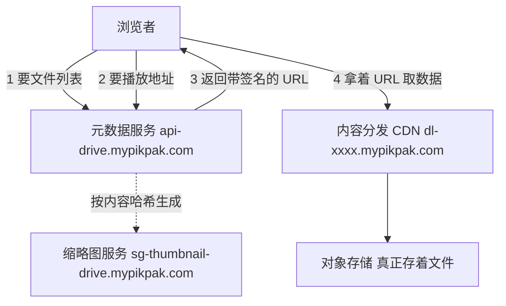
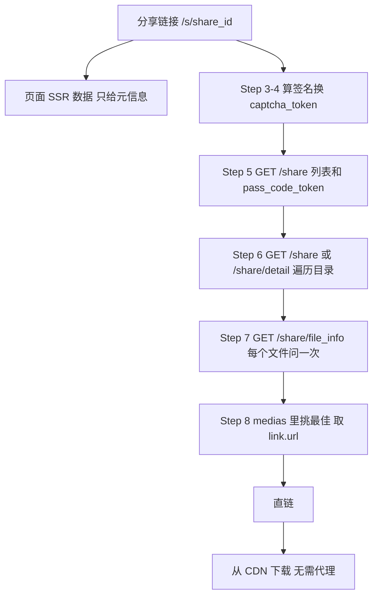
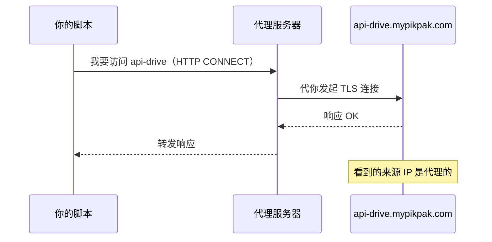
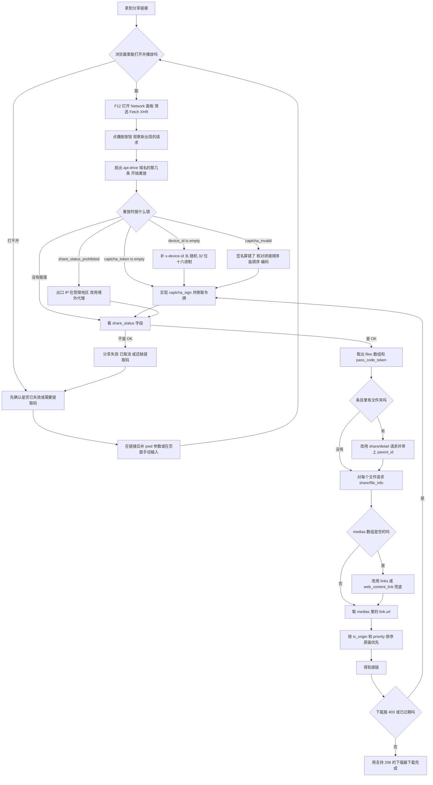
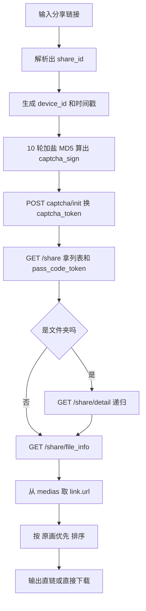

# PikPak 分享链接 → 直链下载：原理与实现详解

本文面向**没有任何相关背景**的读者：先讲清「为什么是这样」，再讲「怎么找出来的」，最后逐段对照 `pikpak_share_dl.py` 解释「每一行在干什么」。

配套代码：

- 完整版（命令行工具，支持文件夹递归 / 代理 / 下载）：[`scripts/pikpak_share_dl.py`](../scripts/pikpak_share_dl.py)
- 最小版（76 行，只留核心链路，适合逐行阅读）：[`scripts/pikpak_minimal.py`](../scripts/pikpak_minimal.py)

---

## 目录

- [1. 目标与最终效果](#1-目标与最终效果)
- [2. 基础知识：先把地基打好](#2-基础知识先把地基打好)
  - [2.1 一次网页请求到底发生了什么](#21-一次网页请求到底发生了什么)
  - [2.2 静态页面 vs 单页应用（SPA）](#22-静态页面-vs-单页应用spa)
  - [2.3 云盘架构：元数据与内容分离](#23-云盘架构元数据与内容分离)
  - [2.4 预签名 URL：直链为什么是"临时"的](#24-预签名-url直链为什么是临时的)
  - [2.5 内容哈希：一个文件为什么只存一份](#25-内容哈希一个文件为什么只存一份)
  - [2.6 鉴权三件套：client_id / device_id / token](#26-鉴权三件套client_id--device_id--token)
  - [2.7 风控：验证码与 captcha_token](#27-风控验证码与-captcha_token)
  - [2.8 地理围栏：地区限制是怎么做出来的](#28-地理围栏地区限制是怎么做出来的)
- [3. 分析方法论：怎么自己找到这些接口](#3-分析方法论怎么自己找到这些接口)
- [4. 本次分析的完整链路](#4-本次分析的完整链路)
- [5. 分步详解（对照脚本）](#5-分步详解对照脚本)
  - [Step 1 解析输入链接](#step-1-解析输入链接)
  - [Step 2 造 device_id 与 timestamp](#step-2-造-device_id-与-timestamp)
  - [Step 3 计算 captcha_sign（核心难点）](#step-3-计算-captcha_sign核心难点)
  - [Step 4 换取 captcha_token](#step-4-换取-captcha_token)
  - [Step 5 读取分享信息](#step-5-读取分享信息)
  - [Step 6 列目录与翻页](#step-6-列目录与翻页)
  - [Step 7 取文件详情，拿到直链](#step-7-取文件详情拿到直链)
  - [Step 8 挑选最佳链接](#step-8-挑选最佳链接)
  - [Step 9 下载](#step-9-下载)
- [6. 地区限制与代理](#6-地区限制与代理)
- [7. 边界、风险与合规](#7-边界风险与合规)
- [8. 逐步排查决策树与最小实现](#8-逐步排查决策树与最小实现)
  - [8.1 决策树：从分享链接到直链](#81-决策树从分享链接到直链)
  - [8.2 最小可运行版本](#82-最小可运行版本)
- [9. 附录](#9-附录)
  - [9.1 字段速查表](#91-字段速查表)
  - [9.2 排错对照表](#92-排错对照表)
  - [9.3 本文各结论的验证强度](#93-本文各结论的验证强度)
  - [9.4 术语表](#94-术语表)

---

## 1. 目标与最终效果

**输入**：一个 PikPak 分享链接，例如

```
https://mypikpak.com/s/VP2DqofIa881OLWRaKYH0OYco2
```

**输出**：一个可以直接 `curl` / 迅雷 / IDM 下载的地址，例如（已截断）

```
https://dl-a10b-1558.mypikpak.com/download/?fid=HChG0u4K...&g=75E81EB36EB3...&f=1130887996&sign=E7ACA9BB85CF42F0C27673687ADB0C5B
```

**先建立一个关键认知**：这件事**不是**在"暴力破解"或"绕过付费"，而是——

> 浏览器里的播放器本来就会向服务器要这个直链，我们只是把同样的请求，用一个我们自己能控制请求头的 HTTP 客户端**重放**一遍。

整个任务的技术难度集中在两点：**找到那个请求长什么样**，以及**复现它要求的身份凭证**。

---

## 2. 基础知识：先把地基打好

### 2.1 一次网页请求到底发生了什么

浏览器打开一个网址，本质是发一条 HTTP 请求。请求由几部分组成：

```
GET /s/VP2DqofIa881OLWRaKYH0OYco2 HTTP/1.1     ← 方法 + 路径 + 协议版本
Host: mypikpak.com                             ← 请求头（Headers）
User-Agent: Mozilla/5.0 ...
Accept-Language: zh-CN
Cookie: ...

（请求体 Body，GET 通常没有）
```

- **方法**：`GET`（取数据）、`POST`（提交数据）。
- **请求头**：一堆 `名字: 值` 的键值对。**身份凭证基本都藏在这里**——这是本文的核心。
- **响应**：状态码（`200` 成功、`400` 参数错、`403` 拒绝）+ 响应头 + 响应体（HTML 或 JSON）。

关键点：**HTTP 是无状态的**。服务器不"记得"你是谁，所以每次请求都必须自带凭证。凭证可以是 Cookie、可以是 Header、也可以塞在 URL 的查询参数里。

本文会反复用到的一个技巧：同一个凭证，**放在 Header 里和放在查询参数里，很多服务器都认**。这一点在受限环境下特别有用（见 6.2）。

### 2.2 静态页面 vs 单页应用（SPA）

老式网页：服务器把 HTML 拼好，数据直接写在 HTML 里，`Ctrl+U` 看源码就能拿到一切。

现代网页（PikPak 就是）：服务器只返回一个"空壳" HTML + 一大堆 JavaScript。真正的数据由 JS 在浏览器里发起**额外的 API 请求**（XHR / fetch）拿到，再动态填进页面。

这带来两个后果：

1. **`Ctrl+U` 看不到数据**。所以"右键查看网页源代码找视频地址"这类老办法失效了。
2. 你要的东西，一定在某条 **API 请求的响应里**。找到那条请求，问题就解决了一半。

PikPak 用的是 **Nuxt**（Vue 的服务端渲染框架）。它有个中间态：服务器会把首屏需要的数据预先渲染进 HTML，同时塞一段 JSON 供浏览器"接管"（hydration）时复用。这段 JSON 长这样：

```html
<script type="application/json" id="__NUXT_DATA__">[[...],  {...}, ...]</script>
```

我们这次确实在里面找到了**文件元信息**（文件名、大小、`file_id`、内容哈希）——但**没有直链**。原因见 2.4：直链是每个访客、每次请求都重新签发的，不可能预渲染。

### 2.3 云盘架构：元数据与内容分离

理解云盘的架构，能解释后面一大半现象。



- **元数据服务**（API）：管"谁有什么文件、文件叫什么、多大、在哪台机器上"。它**不传输文件内容**。
- **内容服务**（CDN）：只管"把这一坨字节发给你"。它**不认识用户**，也不管你有没有权限。
- **缩略图服务**：按文件内容哈希生成截图，独立域名。

两个服务是**解耦**的。这就是为什么会出现"API 被地区限制、但直链还能下载"的现象——它们在两套完全独立的系统上（详见第 6 节）。

### 2.4 预签名 URL：直链为什么是"临时"的

CDN 不认识用户，那它怎么防住"随便谁都能下载"?答案是 **URL 签名**。

元数据服务在你请求时，临时算出一个带签名的 URL：

```
https://dl-a10b-1558.mypikpak.com/download/
  ?fid=HChG0u4K...      ← 内容标识（fid）
  &g=75E81EB3...        ← 内容哈希 gcid
  &f=1130887996         ← 文件大小（字节）
  &expire=1790596879    ← 过期时间（Unix 秒）
  &category=original    ← 原画 / 转码
  &t=0                  ← 版本标记
  &sign=E7ACA9BB...     ← 服务端用私钥算出的签名
```

CDN 收到请求后，用同样的算法**重算一遍**签名，对不上就拒绝。`expire` 过期同样拒绝。

这个机制的直接推论：

- **链接是临时的**。本次实测有效期约 16 小时（响应里 `expire` 字段写得很清楚）。
- **链接等同于临时凭据**。有效期内任何人拿到都能下载，所以不要公开贴出去。
- **链接不可预测**。签名由服务端私钥生成，客户端算不出来，只能乖乖问 API 要。

> 这也解释了为什么必须"重放 API 请求"：客户端没有任何办法自己造出直链。

### 2.5 内容哈希：一个文件为什么只存一份

看看这次文件的几个字段：

| 字段 | 值 |
|---|---|
| `hash`（也叫 gcid） | `75E81EB36EB3D7EFF773360B8D4F3A5605829A4F` |
| `size` | `1130887996` |

`hash` 是**文件内容的哈希**（内容寻址）。同样的文件，无论谁上传、传几次，哈希都一样。所以云盘能：

- **秒传**：上传前先算哈希，服务器已有就只记一条索引。
- **去重存储**：同一份内容只存一份。
- **派生资源按哈希定位**：转码后的 720P 版本、视频截图，都用哈希当目录名。这次看到缩略图 URL 是：

  ```
  https://sg-thumbnail-drive.mypikpak.com/v0/screenshot-thumbnails/75E81EB36EB3D7EFF773360B8D4F3A5605829A4F/720/2048
  ```

  注意那个 `75E81EB3...` 就跟 `hash` 一模一样——同一个内容，多种表示。

### 2.6 鉴权三件套：client_id / device_id / token

PikPak 的接口用三个 HTTP 头来识别调用方：

| 请求头 | 含义 | 我们怎么得到 |
|---|---|---|
| `x-client-id` | **哪个客户端**。Web、安卓 App、桌面端各有一个 ID。本次用的是 Web 端的 `YUMx5nI8ZU8Ap8pm` | 从浏览器 JS 里搜出来的常量 |
| `x-device-id` | **哪台设备**。客户端自己随机生成 32 位十六进制，存在浏览器 `localStorage` 里 | 我们自己随机生成一个 |
| `x-captcha-token` | 本次请求的**风控令牌** | 见 2.7，需要计算 |

这里有一个极其重要的结论：

> **访问公开分享不需要登录。** 整个流程没有 `Authorization: Bearer ...`（登录令牌），只有上面这三个"匿名身份"头。分享链接本身是公开的，任何人可看。

这也是为什么脚本里**没有账号密码**，而且这决定了整件事的性质——只是访问公开资源，不是突破权限。

### 2.7 风控：验证码与 captcha_token

既然没有登录态，服务器怎么防机器人刷接口?用一个叫 **shield（盾）** 的独立风控服务，流程是两级：

```
第 1 级：客户端本地计算 captcha_sign   ← 证明"我是正规客户端"
              ↓ 提交
第 2 级：向 shield 服务换 captcha_token ← 服务器签发，附带回执
              ↓ 带上
第 3 级：正式业务请求（/share、/share/file_info ...）
```

**为什么第 1 级用签名？** 因为要区分"浏览器里的正规前端"和"随便写个脚本刷接口"。做法是：客户端代码里埋一组**只有官方前端才知道的盐值（salt）**，把客户端标识、设备号、时间戳和这些盐做多轮哈希，得到一个 `captcha_sign`。服务端有同一套盐，能验证这个签名算得对不对。

**这算"安全机制"吗？** 严格说不算。盐值就写在公开的前端 JS 里，任何人都能读出来复现（本文就是这么干的）。它的真实作用是**提高自动化门槛**——挡住随手写的爬虫，成本极低。

**captcha_token 长什么样？** 本次实测拿到的令牌是三段式，用 `.` 分隔：

```
ck0 . <320 字符的二进制 base64> . <298 字符的 protobuf base64>
```

我们把第三段解出来（URL-safe base64 → protobuf），里面能**明文看到**：

```
YUMx5nI8ZU8Ap8pm                  ← client_id
undefined                         ← client_version
drive.mypikpak.com                ← package_name
d49ea13dbc35328b783e2706814536b7  ← device_id
```

几个有意思的观察：

1. `client_version` 真的是字符串 `"undefined"`。这是官方前端打包时占位符没被替换掉留下的（我们搜到一个常量 `clientVersion:"undefined"`）。服务端居然容忍了。
2. 令牌是**绑定设备与客户端**的，所以中途不能换 device_id。
3. **令牌里没有任何可读的"地区"字段**。这一点很重要——它说明地区限制不是靠令牌判定的，而是靠请求来源 IP（见下节）。

### 2.8 地理围栏：地区限制是怎么做出来的

"地区限制"在工程上的实现通常非常简单粗暴：

> 服务器取出 TCP 连接的**来源 IP**，查 IP 归属地数据库，得到国家代码，再做判断。

本次拿到了直接证据。同一个接口 `GET /drive/v1/privilege/area_country_code` 返回：

```json
{"result":"ACCEPTED","data":{"countryCode":"CN","ip":"114.92.95.53"}}
```

服务端直接把我们机器的出口 IP 和归属国告诉我们了。然后同一个分享接口，两次请求的结果：

| 出口 | 响应 |
|---|---|
| 大陆 IP（本机） | `{"share_status":"PROHIBITED","share_status_text":"抱歉，分享功能在当前地区不可用"}` |
| 境外出口 | `{"share_status":"OK","file_num":"1","files":[...]}` |

**关键推论**：判定依据是**请求从哪台机器发出来**，跟账号、设备号、令牌都无关。所以换个出口就通了，令牌都不用重签（实测：大陆签发的令牌，从境外出口使用照样有效）。

---

## 3. 分析方法论：怎么自己找到这些接口

这一节是"渔"，比"鱼"重要。

### 3.1 标准动作：打开开发者工具

1. 浏览器按 `F12` 打开 DevTools，切到 **Network** 面板，筛选 **Fetch/XHR**。
2. 刷新页面、点击"播放"按钮，**观察新冒出来的请求**。
3. 逐个点开看：请求 URL、请求头、响应 JSON。

对普通网站，到这一步基本就结束了。PikPak 不行，原因有两个：请求带了一堆自制头，且响应被风控保护——**得先搞清楚那些头的来历**。

### 3.2 当页面是 SPA：直接读 JS

DOM 上看不到线索时，就下笨功夫读 JS：

1. **下载页面的 JS 包**。本次页面引用了 **107 个** `.js` chunk（前端会把代码拆成很多小块按需加载），一共约 2.4 MB。
2. **全文搜索关键词**。这是最高效的一招。搜什么：
   - API 路径片段：`drive/v1`、`share/file_info`
   - 请求头名字：`x-device-id`、`x-client-id`
   - 响应字段名：`web_content_link`（从"谁在用这个字段"反推"谁提供的"）
3. **读被打包压缩过的代码**。变量名变成 `Ws`、`Sn`、`Jke` 这种，但**字符串常量不会变**，所以按字符串搜索总能命中。

### 3.3 从压缩代码里还原逻辑的三个技巧

**技巧一：顺藤摸瓜找定义。**
搜到 `Sn(\`${Ws}/share/file_info?...\`)`，就去找 `Ws` 和 `Sn` 是什么。结果：

```js
Ws = `${Fc}/drive/v1`                       // 所以 API 基址 = Fc + /drive/v1
{PP_DRIVE_API:Fc, PP_USER_API:KIe, ...} = zIe(SV())
zIe = e => ({ PP_DRIVE_API: `https://api-drive.${e}`, PP_USER_API: `https://user.${e}`, ... })
SV  = () => location.hostname.replace(/[-\w]+\.(\w+\.\w+)/, "$1")   // mypikpak.com
```

于是拼出：`https://api-drive.mypikpak.com/drive/v1`。**域名是从页面域名推导出来的**，这种"跟着域名走"的写法很常见，也是为什么存在 `api-drive.mypikpak.net` 这样的镜像域名。

**技巧二：找常量表。**
浏览器登录 SDK 那段代码里有这么一段（压缩后仍然可读）：

```js
const {algorithms:I, timestamp:A, clientVersion:w, packageName:v, clientId:g} = W,
      S = "" + g + w + v + C() + A, B = J(I, S);
withCaptchaMeta: { captcha_sign: `1.${B}`, client_version: w, package_name: v, user_id: ..., timestamp: A }
headers: { "x-device-id": C(), "x-client-id": g, ... }
```

`W` 是一个配置对象，里面是：

```js
W = {
  clientId: "YUMx5nI8ZU8Ap8pm",
  clientVersion: "undefined",
  packageName: "drive.mypikpak.com",
  timestamp: "1790160369858",
  algorithms: [ {alg:"md5", salt:"fyZ4+p77W1U4..."}, ... 共 10 个 ... ]
}
```

**签名算法和 10 个盐值，就这么全暴露了。** 再看 `J`：

```js
const J = (h, l) => {          // h = algorithms, l = 初始字符串
  const c = h.reduce((m, f) => ({ salt: j(m.salt + f.salt) }), { salt: l });
  return c;                    // j = MD5
}
```

一次 `reduce` 就把算法说清楚了：**从上一次的哈希值出发，每次拼一个盐再取 MD5，跑 10 轮**。

**技巧三：从报错反推缺什么。**
这个最实用。当我们只用最朴素的请求去打 API 时：

```
第 1 次：{"detail":"device_id is empty"}          ← 缺 x-device-id
第 2 次：{"detail":"captcha_token is empty"}      ← 缺 x-captcha-token
```

报错信息等于一份**逐步递进的待办清单**，照着补就行。这比硬读代码快得多。

### 3.4 重放（Replay）

找到请求长什么样之后，最后一步是**在本地复现它**：

- 用 `curl` 或 Python 发同样的方法、URL、头、体；
- 对比响应，与浏览器里看到的逐字段核对；
- 一致了就说明复现成功。

本文的脚本本质上就是一个"自动化重放器"，附带把签名算法实现了一遍。

---

## 4. 本次分析的完整链路

把结论先摆出来：



对应的接口清单：

| 步骤 | 方法 | 地址 | 作用 |
|---|---|---|---|
| 换令牌 | POST | `user.mypikpak.com/v1/shield/captcha/init` | 用签名换 `captcha_token` |
| 分享信息 | GET | `api-drive.mypikpak.com/drive/v1/share` | 分享状态、根目录文件、`pass_code_token` |
| 子目录 | GET | `.../drive/v1/share/detail` | 列出某个文件夹里的内容 |
| 文件详情 | GET | `.../drive/v1/share/file_info` | **拿到 `medias[].link.url`，即直链** |

本次样例的对象（后面会反复用到）：

| 名称 | 值 |
|---|---|
| share_id | `VP2DqofIa881OLWRaKYH0OYco2` |
| file_id（视频本身） | `VP2DqnzRhvxgiz05VFNLur_2o2` |
| parent_id（分享根目录） | `VP2DqhZ4pFx4GDJzC0jAhgOZo2` |
| 文件名 | `[UHA-WINGS][JoJo's Bizarre Adventure Steel Ball Run][01][1080p HEVC][CHS_JP].mp4` |
| 大小 | 1,130,887,996 字节（约 1.05 GiB） |
| 规格 | 1920×1080 / HEVC + AAC / 2924 秒 |

---

## 5. 分步详解（对照脚本）

下面每一步都用同一套结构讲：**原理 → 实际请求/响应 → 脚本对应代码**。

---

### Step 1 解析输入链接

#### 原理

用户给的输入五花八门，可能是完整 URL、可能带提取码、可能只是 ID。第一步统一成结构化数据。URL 的结构是：

```
https://mypikpak.com  /s/VP2DqofIa881OLWRaKYH0OYco2  ?pwd=24rn
└──── host ────┘      └──────── path ────────────┘  └ query ┘
```

#### 脚本

```python
def parse_link(link: str):
    """从分享链接里解析出 (share_id, file_id, pass_code)。"""
    share_id = file_id = None
    pass_code = None

    if "://" in link or "/" in link:
        parsed = urllib.parse.urlparse(link if "://" in link else "https://" + link)
        parts = [p for p in parsed.path.split("/") if p]   # ['s', 'VP2DqofIa...']
        if "s" in parts:
            idx = parts.index("s")
            if len(parts) > idx + 1: share_id = parts[idx + 1]
            if len(parts) > idx + 2: file_id  = parts[idx + 2]
        elif parts:
            share_id = parts[-1]
        query = urllib.parse.parse_qs(parsed.query)       # {'pwd': ['24rn']}
        for key in ("pwd", "pass_code", "password", "code"):
            if query.get(key):
                pass_code = query[key][0]
                break
    else:
        share_id = link                                   # 裸 ID
    ...
    return share_id, file_id, pass_code
```

要点：

- `urlparse` 把 URL 拆成 scheme/host/path/query，比手工切字符串可靠。
- `parse_qs` 把查询串解析成字典，**值一定是列表**（因为同名参数可以出现多次），所以取 `[0]`。
- 最后用正则 `[A-Za-z0-9_-]+` 校验 share_id 格式，防住明显的错输入——**早点失败**是好习惯。

实测这四种输入都能正确解析：

| 输入 | 结果 |
|---|---|
| `https://mypikpak.com/s/VP2DqofIa881OLWRaKYH0OYco2` | `(share_id, None, None)` |
| `.../s/VP2DqofIa881OLWRaKYH0OYco2?pwd=24rn` | `(share_id, None, '24rn')` |
| `.../s/VP2DqofIa.../VP2DqnzRhvxgiz05VFNLur_2o2` | `(share_id, file_id, None)` |
| `VP2DqofIa881OLWRaKYH0OYco2` | `(share_id, None, None)` |

---

### Step 2 造 device_id 与 timestamp

#### 原理

上一节说过，接口要 `x-device-id`。官方前端是这么产生的（从 JS 里读到）：

```js
(window.localStorage.getItem("deviceid") || ...)?.split(".").pop()?.substring(0, 32) || ""
```

也就是：存进 `localStorage`，取出来还要做点切割，最终**取 32 个字符作为设备号**。既然服务端不校验这个设备号的"真实性"（它没法校验——设备号本来就是客户端自己生成的），我们**随机造一个符合格式的**就行。

同理，`timestamp` 只是参与签名的当前时间（毫秒）。

#### 脚本

```python
def gen_device_id() -> str:
    """32 位十六进制设备号，前端等同于 localStorage 里的 deviceid。"""
    return "".join(random.choice("0123456789abcdef") for _ in range(32))
```

```python
self.device_id = gen_device_id()
self.timestamp = str(int(time.time() * 1000))     # 毫秒时间戳
```

**为什么用十六进制而不是纯数字或 UUID?** 因为官方生成的就是 32 位十六进制（`[0-9a-f]{32}`），格式对得上方能通过服务端的基础校验。**模仿客户端的行为，而不是自己发明格式**，是重放类任务的一贯原则。

> 补充：设备号是**随机**的，说明它并不承担"防伪"职责，只是"防串号"——让服务端能把同一个访客的多次请求关联起来（做限流、风险分析）。

---

### Step 3 计算 captcha_sign（核心难点）

#### 原理

这是整个任务里唯一一段真正的"算法"。回顾从 JS 里挖出来的信息：

```js
S = "" + clientId + clientVersion + packageName + deviceId + timestamp
B = J(algorithms, S)           // 10 轮加盐 MD5
captcha_sign = `1.${B}`
```

翻译成人话：**以"客户端档案"为起点，反复"加盐取 MD5" 10 次**。

用伪代码表示：

```
value = clientId + clientVersion + packageName + deviceId + timestamp
for salt in [salt1, salt2, ..., salt10]:
    value = md5_hex(value + salt)
captcha_sign = "1." + value
```

#### 为什么这么设计？

- **绑定了一堆上下文**：client_id、客户端版本、包名、设备号、时间戳，全都被"嚼"进最终结果。任何一项改动，签名立刻不同，所以签名**无法从一个设备复制到另一个设备**。
- **加了时间戳**：让签名不能无限期复用（服务端可以校验时间窗口）。
- **加了盐**：盐是实现门槛。没有这 10 个盐，你不知道怎么算，也就没法伪造签名。
- **用 `md5` 迭代而不是 HMAC**：这是"够用就好"的工程取舍。它不是密码学意义上的安全设计——**因为它依赖"算法保密"**，而算法就躺在公开的前端 JS 里。

所以这个机制的准确定位是：**反自动化的减速带**，不是安全边界。

#### 脚本

盐值原样搬进代码：

```python
CAPTCHA_SALTS = [
    "fyZ4+p77W1U4zcWBUwefAIFhFxvADWtT1wzolCxhg9q7etmGUjXr",
    "uSUX02HYJ1IkyLdhINEFcCf7l2",
    "iWt97bqD/qvjIaPXB2Ja5rsBWtQtBZZmaHH2rMR41",
    "3binT1s/5a1pu3fGsN",
    "8YCCU+AIr7pg+yd7CkQEY16lDMwi8Rh4WNp5",
    "DYS3StqnAEKdGddRP8CJrxUSFh",
    "crquW+4",
    "ryKqvW9B9hly+JAymXCIfag5Z",
    "Hr08T/NDTX1oSJfHk90c",
    "i",
]
```

算法实现只有四行：

```python
def calc_captcha_sign(device_id: str, timestamp: str) -> str:
    sign = CLIENT_ID + CLIENT_VERSION + PACKAGE_NAME + device_id + timestamp
    for salt in CAPTCHA_SALTS:
        sign = md5_hex(sign + salt)      # 每轮：上一轮结果 + 盐 → MD5
    return "1." + sign
```

逐个对照：

| 代码 | 对应 JS | 说明 |
|---|---|---|
| `CLIENT_ID + CLIENT_VERSION + PACKAGE_NAME + device_id + timestamp` | `"" + g + w + v + C() + A` | 拼接顺序**必须一致**，少一个空格都不行 |
| `for salt in CAPTCHA_SALTS` | `h.reduce(...)` | **顺序必须一致**，JS 的 `reduce` 是正序遍历数组 |
| `md5_hex(sign + salt)` | `j(m.salt + f.salt)` | 拼接顺序是"**旧值 + 盐**"，不是"盐 + 旧值" |
| `"1." + sign` | `` `1.${B}` `` | 版本前缀，可能是协议版本号 |

```python
def md5_hex(text: str) -> str:
    return hashlib.md5(text.encode("utf-8")).hexdigest()
```

- `.encode("utf-8")`：`hashlib` 只吃字节，不吃字符串。**编码方式必须和 JS 一致**——JS 的字符串按 UTF-8 处理，所以这里也用 UTF-8。
- `.hexdigest()`：输出 32 位小写十六进制。JS 那边的 MD5 库输出格式一致。

**踩坑提示**：这类"复现签名"任务的失败原因，九成是三个"不一致"——**拼接顺序不一致、盐的顺序不一致、编码/大小写不一致**。排查时不要靠猜，直接把两个实现的中间结果打断点逐一比对。

#### 最难的一步其实是"找到定义"

值得单独说一下：`W` 那个配置对象在压缩代码里长这样，是被混淆器打散过的——

```js
const{algorithms:I,timestamp:A,clientVersion:w,packageName:v,clientId:g}=W, ...
```

而 `W` 的定义在别处，中间隔着大段代码。当时是靠在几个候选 chunk 里搜索盐值的字面量（`"fyZ4+p77W1U4..."`）才定位到的。**字符串常量是压缩代码里唯一不会变形的东西**，这是逆向压缩 JS 时最可靠的抓手。

---

### Step 4 换取 captcha_token

#### 原理

算出的 `captcha_sign` 只是一份"自证"。拿着它去 shield 服务换一枚正式的**通行令牌** `captcha_token`，后面每个业务请求都带上它。

请求要说明**"我是为了做什么事而来"**，这就是 `action` 参数。它的格式是 `方法:路径`，例如：

```
GET:/drive/v1/share
GET:/drive/v1/share/file_info
```

**为什么要区分 action?** 因为不同操作的敏感度不同。列目录和下载的令牌可以设不同有效期、不同风控等级。我们的脚本为每个接口单独申请、单独缓存（`self._captcha_tokens` 字典）。

#### 实际请求

```http
POST /v1/shield/captcha/init HTTP/1.1
Host: user.mypikpak.com
Content-Type: application/json

{
  "client_id": "YUMx5nI8ZU8Ap8pm",
  "action": "GET:/drive/v1/share",
  "device_id": "d49ea13dbc35328b783e2706814536b7",
  "meta": {
    "captcha_sign": "1.6ac5ab5805e33d8b6a1aac2adad1421d",
    "client_version": "undefined",
    "package_name": "drive.mypikpak.com",
    "user_id": "",
    "timestamp": "1790510243707"
  }
}
```

实测响应（令牌已截断）：

```json
{"captcha_token":"ck0.QnEAzsi-8cuN6hem...PI.CloIkfT0lY40EhBZ...Aw"}
```

#### 脚本

```python
def _captcha_token(self, action: str) -> str:
    """为某个 action 申请验证码令牌，例如 "GET:/drive/v1/share"。"""
    if action in self._captcha_tokens:          # ① 命中缓存直接返回
        return self._captcha_tokens[action]
    body = {
        "client_id": CLIENT_ID,
        "action": action,
        "device_id": self.device_id,
        "meta": {
            "captcha_sign": self.captcha_sign,
            "client_version": CLIENT_VERSION,
            "package_name": PACKAGE_NAME,
            "user_id": "",
            "timestamp": self.timestamp,
        },
    }
    status, text = self._http(
        "POST",
        f"{USER_API}/v1/shield/captcha/init",
        {"x-device-id": self.device_id, "x-client-id": CLIENT_ID,
         "User-Agent": USER_AGENT},
        body,
    )
    data = self._loads(text)
    token = data.get("captcha_token")
    if not token:
        raise PikPakError(f"获取验证码令牌失败: {text[:300]}")
    self._captcha_tokens[action] = token         # ② 存缓存
    return token
```

① 缓存很有必要：**令牌是申请一次、可以多次使用**的，没必要每个文件都重新申请。

② 注意 `user_id` 传的是空字符串——因为我们没登录。**空字符串和"不传"在服务端语义不同**，这里照抄前端行为传空串。

#### 底层 HTTP 是怎么发的

```python
def _http(self, method: str, url: str, headers: dict, body=None):
    data = None
    if body is not None:
        data = json.dumps(body).encode("utf-8")
        headers = dict(headers, **{"Content-Type": "application/json"})
    req = urllib.request.Request(url, data=data, headers=headers, method=method)
    try:
        with self.opener.open(req, timeout=self.timeout) as resp:
            return resp.status, resp.read().decode("utf-8", "replace")
    except urllib.error.HTTPError as exc:
        # 业务错误也是 4xx + JSON body，这里照常返回
        return exc.code, exc.read().decode("utf-8", "replace")
```

这里有个**很多人会踩的坑**：`urllib` 默认把 HTTP 4xx/5xx 当异常抛出（`HTTPError`）。但这类 API **故意**用 4xx 返回业务错误 JSON（比如 `captcha_invalid`），body 里有我们需要的诊断信息。所以我们要把它**当正常响应处理**，读出来交给上层判断，而不是让它抛掉。

`resp.read().decode("utf-8", "replace")` 里的 `"replace"` 是容错：万一遇到非 UTF-8 字节，用替代字符而不是崩溃。

---

### Step 5 读取分享信息

#### 原理

先问"这个分享是什么、里面有什么"。这一步顺带拿到后续要用的 `pass_code_token`。

#### 实际请求

```http
GET /drive/v1/share?share_id=VP2DqofIa881OLWRaKYH0OYco2&pass_code=&limit=100&thumbnail_size=SIZE_LARGE HTTP/1.1
Host: api-drive.mypikpak.com
x-device-id: d49ea13dbc35328b783e2706814536b7
x-client-id: YUMx5nI8ZU8Ap8pm
x-captcha-token: ck0.QnEAzsi-...
Accept-Language: zh-CN
Origin: https://mypikpak.com
Referer: https://mypikpak.com/
```

几个参数的作用：

| 参数 | 说明 |
|---|---|
| `share_id` | 分享标识 |
| `pass_code` | 提取码，没有就传空串 |
| `limit=100` | 一次最多取 100 条 |
| `thumbnail_size` | 顺便要哪种尺寸的缩略图 URL |

#### 实测响应（节选）

境外出口：

```json
{
  "share_status": "OK",
  "file_num": "1",
  "files": [ { "kind":"drive#file", "id":"VP2DqnzRhvxgiz05VFNLur_2o2",
               "name":"[UHA-WINGS]...[1080p HEVC][CHS_JP].mp4",
               "size":"1130887996", "mime_type":"video/mp4",
               "hash":"75E81EB36EB3D7EFF773360B8D4F3A5605829A4F",
               "web_content_link":"", "links":{}, "medias":[] } ],
  "pass_code_token": "KBvtcmnskZ2dYnBvmg3LXqm4fxqRmHzuxW2Jymf0x/q7y...Q=",
  "user_info": { "nickname": "1hlt**d2q6" },
  "params": { "anonymous_play_seconds": "120", "auto_play": "false" }
}
```

大陆出口：

```json
{"share_status":"PROHIBITED","share_status_text":"抱歉，分享功能在当前地区不可用","files":[]}
```

**注意 `files` 里的 `web_content_link` 和 `links` 都是空的**——这就是为什么必须再单独问一次 `file_info`（Step 7）。列表接口只给"清单"，不给"取件凭证"。

#### 脚本

```python
def open_share(self, share_id: str, pass_code: str = "") -> dict:
    """读取分享信息，返回分享级元数据。"""
    self.share_id = share_id
    self.pass_code = pass_code or ""

    data = self.api("GET", "/share", {
        "share_id": share_id, "pass_code": self.pass_code,
        "limit": "100", "thumbnail_size": "SIZE_LARGE",
    })

    status = data.get("share_status")
    if status != "OK":
        text = data.get("share_status_text") or ""
        hint = ""
        if status == "PROHIBITED" or "地区" in text:
            hint = ("\n当前出口 IP 被地区限制，请用 --proxy 指定境外代理"
                    "（如 --proxy http://127.0.0.1:7890）")
        raise ShareError(f"分享不可用: share_status={status} {text}{hint}")

    self.pass_code_token = data.get("pass_code_token") or ""
    self.global_file_token = data.get("global_file_token") or ""
    return data
```

三个设计考虑：

1. **把 `pass_code_token` 存进实例状态**（`self.pass_code_token`），因为后面每一步都要用它，层层传参很啰嗦。
2. **主动检查 `share_status`**。接口用 HTTP 200 + `share_status != "OK"` 表达"分享有问题"，不检查的话后面会拿到一堆莫名其妙的空数据。
3. **把常见的 `PROHIBITED` 翻译成给用户的行动建议**（"请用 `--proxy`"）。错误信息应该告诉人**下一步该做什么**，而不是只报告"失败了"。

#### 统一的后业务请求封装

```python
def api(self, method, path, params=None, body=None, headers=None) -> dict:
    url = DRIVE_API + path
    if params:
        url += "?" + urllib.parse.urlencode(params)
    action = f"{method}:{path}"              # ① 自动推导 action

    for attempt in range(2):                 # ② 最多两次尝试
        head = {
            "x-device-id": self.device_id,
            "x-client-id": CLIENT_ID,
            "Accept-Language": "zh-CN",
            "Origin": "https://mypikpak.com",
            "Referer": "https://mypikpak.com/",
            "User-Agent": USER_AGENT,
        }
        head.update(headers or {})
        head["x-captcha-token"] = self._captcha_token(action)

        _, text = self._http(method, url, head, body)
        data = self._loads(text)

        if data.get("error") == "captcha_invalid" and attempt == 0:
            self._captcha_tokens.pop(action, None)   # ③ 丢弃失效令牌
            continue
        if data.get("error"):                        # ④ 其他错误直接抛
            raise PikPakError(f"{data.get('error')}: {data.get('error_description','')}")
        return data
    raise PikPakError("验证码校验失败")
```

| 标记 | 作用 |
|---|---|
| ① | `action` 由 `方法:路径` 自动拼出，不用手写，避免不一致 |
| ② | 令牌有生命周期，会过期。**重试一次**是处理过期最省事的方式 |
| ③ | 关键：先**从缓存里删掉**失效令牌，下一轮才会去申请新的（否则会一直用同一个坏令牌） |
| ④ | 业务错误统一在这里抛出，调用方不用每个接口都写一遍判断 |

---

### Step 6 列目录与翻页

#### 原理

分享可能是单个文件（本例），也可能是一整个文件夹（很常见，比如一季动画）。要遍历就得处理两件事：**区分根目录和子目录**、**翻页**。

从 JS 里读出来两个细节：

- 根目录走 `GET /share`，参数用 `pass_code`；
- 子目录走 `GET /share/detail`，参数用 `pass_code_token` + `parent_id`。
- 翻页参数是 `next_page_token`（第一页不传，响应给了就带上取下一页）。

#### 脚本

```python
def list_dir(self, parent_id: str | None = None) -> list:
    """列出分享根目录 / 子目录下的文件（自动翻页）。"""
    out, token = [], None
    while True:
        params = {
            "share_id": self.share_id,
            "limit": "100",
            "thumbnail_size": "SIZE_LARGE",
        }
        if parent_id:
            params["parent_id"] = parent_id
            params["pass_code_token"] = self.pass_code_token
            path = "/share/detail"          # ① 子目录用另一个接口
        else:
            params["pass_code"] = self.pass_code
            path = "/share"
        if token:
            params["next_page_token"] = token   # ② 翻页
        ...
        token = data.get("next_page_token")
        if not token or not entries:            # ③ 没有下一页就停
            break
    return out
```

① 同一个端点族里，根目录和子目录是两个 URL，参数类型也不同（`pass_code` vs `pass_code_token`）。这是 API 设计里挺常见的"不对称"。

②③ **翻页循环必须有两个退出条件**：服务端说没有下一页了（`not token`），或者这一页**没有返回任何条目**（`not entries`）。只判断前者的话，万一服务端给出一个不变的分页令牌，脚本就会**死循环**。这是一个很容易忽略的防御性写法。

遍历逻辑用一个 BFS 队列实现：

```python
def walk(self, recursive: bool = True):
    """遍历分享里的所有条目，产出 (相对路径, 文件字典)。"""
    queue = [("", None)]                     # (路径前缀, 父目录 id)
    while queue:
        prefix, parent_id = queue.pop(0)     # ① 从队首取，先进先出 = 广度优先
        for entry in self.list_dir(parent_id):
            name = entry.get("name") or entry.get("id") or ""
            path = prefix + name
            if entry.get("kind") == "drive#folder":
                if recursive:
                    queue.append((path + "/", entry.get("id")))   # ② 目录入队
                yield path + "/", entry
            else:
                yield path, entry            # ③ 文件直接产出
```

- ① 用 `pop(0)` 而不是 `pop()`：**队列**（广度优先）而不是**栈**（深度优先）。对文件树来说区别不大，但队列的结果是"按层级顺序"，输出更好看。
- ② 只有目录才继续往下钻，并且**把路径前缀带下去**，这样最终每个文件都带着 "文件夹/子文件夹/文件名" 的完整路径。
- ③ 用 `yield` 而不是"攒成一个 list 返回"：**惰性求值**。分享里有一万张图时，不必先在内存里堆一万个对象才开始处理。

---

### Step 7 取文件详情，拿到直链

#### 原理

这是产出直链的一步。问"这个文件的详情"，响应里会带**多种清晰度**的下载地址。

#### 实际请求

```http
GET /drive/v1/share/file_info
      ?share_id=VP2DqofIa881OLWRaKYH0OYco2
      &file_id=VP2DqnzRhvxgiz05VFNLur_2o2
      &pass_code_token=KBvtcmnskZ2dYnBvmg3LXqm4fxqRmHzuxW2Jymf0x%2Fq7y...%3D
      &thumbnail_size=SIZE_LARGE
HTTP/1.1
Host: api-drive.mypikpak.com
x-device-id: d49ea13dbc35328b783e2706814536b7
x-client-id: YUMx5nI8ZU8Ap8pm
x-captcha-token: ck0.3r2BUqp4rJXrKC-...
x-global-file-token: 
```

注意 `pass_code_token` 在 URL 里，**必须 URL 编码**（`/` → `%2F`，`=` → `%3D`），因为它本身是 base64，含特殊字符。`urlencode` 会自动处理这件事。

#### 实测响应（关键部分）

```json
{
  "share_status": "OK",
  "file_info": {
    "id": "VP2DqnzRhvxgiz05VFNLur_2o2",
    "name": "[UHA-WINGS]...[1080p HEVC][CHS_JP].mp4",
    "size": "1130887996",
    "hash": "75E81EB36EB3D7EFF773360B8D4F3A5605829A4F",
    "medias": [
      {
        "media_name": "Original",
        "resolution_name": "1080P",
        "category": "category_origin",
        "is_origin": true,
        "priority": 0,
        "video": { "width":1920, "height":1080, "duration":2924,
                   "bit_rate":2860547, "video_codec":"hevc", "audio_codec":"aac" },
        "link": {
          "url": "https://dl-a10b-1558.mypikpak.com/download/?fid=...&sign=E7ACA9BB...",
          "expire": "2026-09-28T08:01:19.860+08:00",
          "token": "eyJhbGciOiJSUzI1NiIsInR5cCI6IkpXVCJ9..."   ← JWT
        }
      },
      {
        "media_name": "720P",
        "resolution_name": "720P",
        "category": "category_transcode",
        "is_origin": false,
        "priority": 6,
        "link": { "url": "https://dl-a10b-0860.mypikpak.com/download/?...&sign=A476B1AE..." }
      }
    ],
    "params": { "duration":"2924", "width":"1920", "height":"1080",
                "anonymous_play_seconds":"120", "anonymous_play_range":"0.40" }
  }
}
```

**结论：直链就在 `file_info.medias[].link.url`。** 数组里每一项是一个清晰度，`is_origin: true` 的那项是原始文件。

`link.token` 那个 `eyJ...` 是 **JWT**（JSON Web Token，一种自包含的签名令牌）。它和 URL 签名是两套机制：URL 签名给 CDN 校验，JWT 里则可以携带更多上下文。本次我们只需要 URL 就够用了。

另外注意 `params.anonymous_play_seconds: "120"`——**匿名用户在线播放只能看前 120 秒**，但**下载**不受此限制。这是一个有意思的产品设计差异。

#### 脚本

```python
def file_info(self, file_id: str) -> dict:
    """获取单个文件的详情，其中 medias[].link.url 就是直链。"""
    data = self.api("GET", "/share/file_info", {
        "share_id": self.share_id,
        "file_id": file_id,
        "pass_code_token": self.pass_code_token,
        "thumbnail_size": "SIZE_LARGE",
    }, headers={"x-global-file-token": self.global_file_token})

    status = data.get("share_status")
    if status and status != "OK":
        raise ShareError(f"文件不可用: share_status={status}")
    return data.get("file_info") or data
```

最后一行 `data.get("file_info") or data` 是个小技巧：响应外层是 `{share_status, file_info}`，我们只要内层。但万一服务端某些情况下不包这层，就退回整个响应——**兼容两种可能的返回结构，代价只有几个字符**。

---

### Step 8 挑选最佳链接

#### 原理

每个文件可能有好几条链接（原画、720P、有时还有更多档）。需要一个明确的**优先级规则**：

1. **原画优先**（`is_origin == true`），因为它是无损的原始文件；
2. 其次按 `priority` **降序**（服务端给的推荐顺序）;
3. 兜底：有些非视频文件（压缩包、文档）不放在 `medias` 里，而是在 `links` 字典或 `web_content_link` 字段里。

#### 脚本

```python
@staticmethod
def extract_links(file_info: dict) -> list:
    """从 file_info 中提取所有可下载直链，按 原画优先、优先级降序 排列。"""
    links = []

    def add(url, name, resolution="", category="", expire="", is_origin=False,
            priority=0, size=None):
        if not url:
            return                       # ① 空 URL 直接丢
        links.append({ "name": name, "resolution": resolution,
                       "category": category, "size": ...,
                       "expire": expire, "is_origin": bool(is_origin),
                       "priority": priority, "url": url })

    for media in file_info.get("medias") or []:      # ② 主来源
        link = media.get("link") or {}
        add(link.get("url"), media.get("media_name") or ..., ...)

    for key, value in (file_info.get("links") or {}).items():   # ③ 兜底一
        url = value.get("url") if isinstance(value, dict) else value
        add(url, key, category="direct", size=file_info.get("size"))
    add(file_info.get("web_content_link"), "web_content",        # ③ 兜底二
        category="direct", size=file_info.get("size"))

    links.sort(key=lambda x: (not x["is_origin"], -x["priority"]))   # ④ 排序
    return links
```

④ 这个排序键值得解释，它是**一个很实用的 Python 技巧**：

- `not x["is_origin"]`：`True` 排在 `False` 后面 → 所以**原画排最前**。
- `-x["priority"]`：取负 → 因为 `sort` 是升序，取负就变成**降序**。
- 元组比较是**逐元素**的：先按"是不是原画"排，同档再按 priority 排。**一次 `sort` 完成两级排序**，不需要写自定义比较函数。

③ 兜底逻辑的来源：我们最初实测时看到 `/share` 响应里有 `links: {}` 和 `web_content_link: ""` 两个字段。虽然这次是空的，但字段存在说明**其他类型的文件会用它们**，所以要处理。

实测验证（用真实响应体做的测试）：

```
origin=True  prio=0  tag=1080P   → https://dl-a10b-1558.mypikpak.com/... sign=DEADBEEF
origin=False prio=6  tag=720P    → https://dl-a10b-0860.mypikpak.com/... sign=CAFEBABE
```

1080P 原画被正确排在第一位。

---

### Step 9 下载

#### 原理

拿到直链后下载就是普通的 HTTP GET。两个细节：

1. **流式读取**。文件有 1 GB，绝不能 `resp.read()` 一次性读进内存。
2. **进度显示**。按块读、按块写，顺便统计速度。

#### 脚本

```python
CHUNK = 256 * 1024        # 每块 256 KiB

def download(url: str, dest: str, timeout: int = 30):
    """流式下载并打印进度。"""
    req = urllib.request.Request(url, headers={"User-Agent": USER_AGENT})
    with urllib.request.urlopen(req, timeout=timeout) as resp:
        total = int(resp.headers.get("Content-Length") or 0)
        done = start = 0
        t0 = time.time()
        with open(dest, "wb") as fh:
            while True:
                chunk = resp.read(CHUNK)      # ① 一次只读一块
                if not chunk:                 # ② 空块 = 读完了
                    break
                fh.write(chunk)
                done += len(chunk)
                now = time.time()
                if now - start > 0.3:         # ③ 限流刷新进度
                    speed = done / max(now - t0, 1e-6)
                    ...
```

① `read(大小)` 读固定大小的块——这是处理大文件的标准姿势。
② HTTP 响应体读完时会返回空字节串 `b""`，用它作结束标记。
③ 每 0.3 秒才刷新一次进度：**不限制的话，每次都往终端写会让下载本身变慢**（终端 I/O 是瓶颈）。

真实下载会是这样（curl 实测的响应头）：

```
HTTP/1.1 206 Partial Content      ← 支持 Range 断点续传
Content-Type: application/octet-stream
```

`206` 说明 CDN 支持分段下载（多线程下载器/迅雷就是靠这个提速的）。

---

## 6. 地区限制与代理

### 6.1 现象与机制

前面 2.8 已经给了实测证据。这里补一个重要的**反直觉结论**：

> **API 被地区限制 ≠ 下载不了。**

实测确认：

- `dl-a10b-1558.mypikpak.com` 的直链**从大陆 IP 直接请求返回 `206`**，能正常下载；
- 但从大陆 IP 调 `api-drive.mypikpak.com` 的分享接口返回 `PROHIBITED`。

原因回到 2.3 的架构图：**风控加在元数据服务上，CDN 上没有**。CDN 只校验 URL 签名和过期时间。

所以实际可行的两种用法：

| 场景 | 做法 |
|---|---|
| 只是想下载 | 从境外拿到直链后，**在大陆直接下**，速度不受影响 |
| 想重新获取直链 | **必须**通过境外出口调 API |

### 6.2 代理是怎么起作用的

`--proxy` 的原理很简单：**请求先发给代理服务器，由代理服务器转发给目标网站**。对目标网站来说，来源 IP 变成了代理的 IP。



脚本里对应这段：

```python
@staticmethod
def _proxy_handlers(proxy: str):
    if proxy.startswith(("socks4", "socks5", "socks")):
        try:
            import socks  # PySocks        # ① SOCKS 需要额外库
        except ImportError:
            raise SystemExit("使用 socks 代理需要先安装 PySocks: pip install PySocks")
        parsed = urllib.parse.urlparse(proxy)
        proxy_type = socks.SOCKS4 if proxy.startswith("socks4") else socks.SOCKS5
        socks.set_default_proxy(proxy_type, parsed.hostname, parsed.port or 1080,
                                rdns=True)   # ② 让代理解析域名
        socket.socket = socks.socksocket
        return [urllib.request.ProxyHandler({})]
    return [urllib.request.ProxyHandler({"http": proxy, "https": proxy})]
```

① Python 标准库只内置了 HTTP 代理支持；**SOCKS 协议是另一个协议族，必须用第三方库 `PySocks`**。Clash、v2ray 之类的工具通常**同时**开放 HTTP 和 SOCKS 端口（比如 Clash 默认 `7890`=HTTP / `7891`=SOCKS），所以用 HTTP 代理端口就够，免去装库。

② `rdns=True` 表示**域名解析交给代理服务器做**（对应 `socks5h://` 里的 `h`）。这一点很关键：如果本地解析域名，会**泄露 DNS 查询**，而且可能因为本地 DNS 被污染而连不上。

### 6.3 顺带一提：把凭证放进 URL 查询参数

本次分析还发现一件事：这些接口**同时接受把 `device_id` / `client_id` / `captcha_token` 放在 URL 查询参数里**。

可以自己验证：把 `device_id` 从 header 挪到 query，报错会从

```
{"detail":"device_id is empty"}
```

变成

```
{"error":"captcha_invalid","error_details":[{"detail":"no client info found"}]}
```

说明 `device_id` 被接受了，只是令牌是假的。

**这个特性有什么用？** 当你处于一个**只能拼 URL、不能设置请求头**的环境时（某些网页代理、某些受限的沙箱工具、某些只支持 URL 的网关），把凭证放 query 是唯一的出路。由于 `captcha_token` 里嵌的是 device_id 而不是来源 IP，**在大陆签发的令牌，拿到境外出口照样能用**，无需重签。

代价：URL 会被记进各种日志（浏览器历史、代理访问日志、服务端 access log），**安全性低于放 header**。所以脚本默认走 header，只把它当兜底手段。

---

## 7. 边界、风险与合规

写清楚这件事**是什么**和**不是什么**：

| 项目 | 说明 |
|---|---|
| 用到的接口 | 全部是**匿名可访问**的公开分享接口 |
| 是否登录 | **否**。全程没有账号密码，没有 `Authorization` 头 |
| 是否绕过付费 | **否**。没有触碰任何会员/VIP 判定逻辑 |
| 是否突破了权限 | **否**。分享本身对所有人公开，脚本做的是"用程序重放浏览器本来就会做的请求" |

需要知道的几点：

1. **服务条款**：地区限制是服务方的合规策略（版权/监管原因）。绕过它在技术上可行，但**可能违反服务条款**，本文只作技术学习与个人研究用途。
2. **版权**：分享的内容本身可能受版权保护，下载、传播的风险由使用者自行承担。
3. **直链是临时凭据**：有效期约 16 小时，且**有效期内任何人拿到都能下载**。不要公开分享。
4. **凭证泄露面**：请求里带了 `device_id`、`captcha_token`。虽然都是匿名信息，但也别往公开渠道贴完整请求。
5. **不要滥用**：脚本是单线程、按需请求（一个文件一次 `file_info`）。**不要改造成批量抓取器**去打别人的分享，那会给服务端造成压力，也可能触发封禁。
6. **别把盐值当"密码"**：`CAPTCHA_SALTS` 是从公开前端代码里读出来的，不是窃取来的。这也说明了该机制的定位。

---

## 8. 逐步排查决策树与最小实现

### 8.1 决策树：从分享链接到直链

一个能跑通的流程只有一条，但**会卡住的地方有很多**。下面这张图是完整的判断路径：圆角方形是动作，菱形是判断，箭头上的文字是「你会看到的报错 / 现象」。



**卡住时按这个顺序自查**（前面的没解决，后面的必然也通不过）：

1. **链接本身有效吗?** 用浏览器直接打开分享页。打不开就是失效 / 被取消，或者需要提取码。
2. **出口地区对吗?** 报 `share_status_prohibited` 就是这一条。换境外代理，**别去折腾签名**——签名没问题，是地区问题。
3. **验证码令牌对吗?** `device_id is empty` / `captcha_token is empty` / `captcha_invalid` 都属于这一层。按顺序补：先有 device_id，再有签名，再有令牌。
4. **签名算对了吗?** 如果是 `captcha_invalid` 且确认令牌是新申请的，就回头看 [Step 3](#step-3-计算-captcha_sign核心难点) 的「三个不一致」：**拼接顺序、盐的顺序、编码与大小写**。
5. **文件在子目录里吗?** 列表里出现 `kind` 为 `drive#folder` 的条目，就要改走 `/share/detail`。
6. **`medias` 是空的吗?** 非视频文件（压缩包、文档）通常不用 `medias`，要看 `links` / `web_content_link`。
7. **直链拿到了但下不动?** 403 基本都是签名过期，重跑一次即可。

> **一个很好用的判断技巧**：报错信息会告诉你卡在哪一层。`device_id` / `captcha` / `share_status` 三类错误，分别对应「身份不够 → 凭证不对 → 地区不对」，看到哪个就知道该翻回本文哪一节。

### 8.2 最小可运行版本

[`scripts/pikpak_minimal.py`](../scripts/pikpak_minimal.py)：76 行，其中核心逻辑约 60 行。它能完整跑通 Step 1~9，只是把外围功能都砍掉了。

```python
#!/usr/bin/env python3
"""PikPak 分享链接 -> 直链：最小可运行版本

配套 docs/pikpak-share-to-direct-link.md 的 Step 1~9，去掉了命令行参数、
文件夹递归、代理重试、下载等外围功能，只保留最短链路。
大陆 IP 调 API 会被地区限制，此时把下面的 PROXY 填成你的代理地址。
"""

import hashlib, json, random, time, urllib.error, urllib.parse, urllib.request

SHARE_LINK = "https://mypikpak.com/s/VP2DqofIa881OLWRaKYH0OYco2"
PROXY = None  # 例如 "http://127.0.0.1:7890"

CLIENT_ID, PACKAGE, VERSION = "YUMx5nI8ZU8Ap8pm", "drive.mypikpak.com", "undefined"
SALTS = ["fyZ4+p77W1U4zcWBUwefAIFhFxvADWtT1wzolCxhg9q7etmGUjXr", "uSUX02HYJ1IkyLdhINEFcCf7l2",
         "iWt97bqD/qvjIaPXB2Ja5rsBWtQtBZZmaHH2rMR41", "3binT1s/5a1pu3fGsN",
         "8YCCU+AIr7pg+yd7CkQEY16lDMwi8Rh4WNp5", "DYS3StqnAEKdGddRP8CJrxUSFh",
         "crquW+4", "ryKqvW9B9hly+JAymXCIfag5Z", "Hr08T/NDTX1oSJfHk90c", "i"]

# Step 2+3：设备号与时间戳，再跑 10 轮加盐 MD5 得到 captcha_sign
DEVICE = "".join(random.choice("0123456789abcdef") for _ in range(32))
STAMP = str(int(time.time() * 1000))
sign = CLIENT_ID + VERSION + PACKAGE + DEVICE + STAMP
for salt in SALTS:
    sign = hashlib.md5((sign + salt).encode()).hexdigest()
CAPTCHA_SIGN = "1." + sign

HEADERS = {"x-device-id": DEVICE, "x-client-id": CLIENT_ID, "Accept-Language": "zh-CN",
           "Origin": "https://mypikpak.com", "Referer": "https://mypikpak.com/",
           "User-Agent": "Mozilla/5.0"}
proxy = urllib.request.ProxyHandler({"http": PROXY, "https": PROXY}) if PROXY else None
opener = urllib.request.build_opener(*([proxy] if proxy else []))


def call(url, action, body=None):
    """发请求；action 非空时先换一枚 captcha_token（Step 4）。"""
    headers = dict(HEADERS)
    if action:
        payload = {"client_id": CLIENT_ID, "action": action, "device_id": DEVICE,
                   "meta": {"captcha_sign": CAPTCHA_SIGN, "client_version": VERSION,
                            "package_name": PACKAGE, "user_id": "", "timestamp": STAMP}}
        req = urllib.request.Request("https://user.mypikpak.com/v1/shield/captcha/init",
                                     data=json.dumps(payload).encode(),
                                     headers={**headers, "Content-Type": "application/json"})
        headers["x-captcha-token"] = json.load(opener.open(req))["captcha_token"]
    data = json.dumps(body).encode() if body else None
    req = urllib.request.Request(url, data=data, headers=headers)  # 有 data 即 POST
    try:
        return json.load(opener.open(req))
    except urllib.error.HTTPError as exc:  # 业务错误也用 4xx 返回 JSON
        return json.load(exc)


API = "https://api-drive.mypikpak.com/drive/v1"
share_id = SHARE_LINK.split("/s/")[1].split("?")[0]      # Step 1

# Step 5：读分享信息，拿到文件列表和 pass_code_token
q = urllib.parse.urlencode({"share_id": share_id, "pass_code": "", "limit": "100"})
meta = call(f"{API}/share?{q}", "GET:/drive/v1/share")
if meta.get("share_status") != "OK":
    raise SystemExit(f"分享不可用：{meta.get('share_status')} {meta.get('share_status_text')}")

# Step 6+7：逐个文件问详情（只处理根目录，不递归文件夹）
for item in meta["files"]:
    if item.get("kind") == "drive#folder":
        continue
    q = urllib.parse.urlencode({"share_id": share_id, "file_id": item["id"],
                                "pass_code_token": meta.get("pass_code_token", "")})
    info = call(f"{API}/share/file_info?{q}", "GET:/drive/v1/share/file_info")["file_info"]

    # Step 8：原画排最前，同档按 priority 降序
    medias = sorted(info.get("medias") or [],
                    key=lambda m: (not m.get("is_origin"), -m.get("priority", 0)))
    print(f"\n{info['name']}  ({int(info['size']) / 1048576:.1f} MiB)")
    for m in medias:
        print(f"  [{m.get('resolution_name') or 'default'}] {m['link']['url']}")
```

#### 按段落对照

| 代码位置 | 对应章节 | 在干什么 |
|---|---|---|
| `CLIENT_ID, PACKAGE, VERSION = ...` | [2.6](#26-鉴权三件套client_id--device_id--token) / Step 3 | 客户端身份三件套，填的是从 JS 里挖出来的值 |
| `SALTS = [...]` | [Step 3](#step-3-计算-captcha_sign核心难点) | 10 个盐，**顺序不能动** |
| `DEVICE = ...` / `STAMP = ...` | [Step 2](#step-2-造-device_id-与-timestamp) | 随机 32 位十六进制设备号 + 毫秒时间戳 |
| `for salt in SALTS: sign = md5(...)` | [Step 3](#step-3-计算-captcha_sign核心难点) | **整个任务唯一的算法** |
| `HEADERS` / `proxy` / `opener` | [2.6](#26-鉴权三件套client_id--device_id--token) / [6.2](#62-代理是怎么起作用的) | 三个必备请求头；按需挂代理 |
| `def call(url, action, body=None)` | [Step 4](#step-4-换取-captcha_token) | 统一入口：需要令牌就先换，再发业务请求 |
| `payload = {...}` | [Step 4](#step-4-换取-captcha_token) | 发给 shield 服务的报文，`meta` 里带签名 |
| `headers["x-captcha-token"] = ...` | [Step 4](#step-4-换取-captcha_token) | 拿到令牌，塞进后续请求的请求头 |
| `except urllib.error.HTTPError` | [Step 4](#step-4-换取-captcha_token) | **关键细节**：4xx 也要读 body |
| `share_id = SHARE_LINK.split(...)` | [Step 1](#step-1-解析输入链接) | 从链接抠 share_id（完整版用 `urlparse` 更稳） |
| `meta = call(f"{API}/share?{q}", ...)` | [Step 5](#step-5-读取分享信息) | 拿文件列表与 `pass_code_token` |
| `if meta.get("share_status") != "OK"` | [Step 5](#step-5-读取分享信息) | 先检查分享状态，避免后面拿到一堆空数据 |
| `for item in meta["files"]` | [Step 6](#step-6-列目录与翻页) | 遍历根目录条目（跳过文件夹） |
| `info = call(...file_info...)` | [Step 7](#step-7-取文件详情拿到直链) | **直链就在这一步的响应里** |
| `medias = sorted(...)` | [Step 8](#step-8-挑选最佳链接) | 原画优先 + priority 降序 |
| `print(m['link']['url'])` | [Step 8](#step-8-挑选最佳链接) / Step 9 | 输出直链 |

#### 三个值得注意的写法

**① `Request` 不显式指定 method**

```python
req = urllib.request.Request(url, data=data, headers=headers)  # 有 data 即 POST
```

`urllib` 的规则是：**给了 `data` 就是 POST，没给就是 GET**。省掉一个参数，也就少一处不一致的可能。

**② 4xx 不走异常，一样当 JSON 读**

```python
try:
    return json.load(opener.open(req))
except urllib.error.HTTPError as exc:  # 业务错误也用 4xx 返回 JSON
    return json.load(exc)
```

`HTTPError` 对象**本身就是个可读的响应对象**（有 `.read()`），所以 `json.load(exc)` 直接就能拿到错误 JSON。这样一来，`share_status != "OK"` 那段判断对正常分支和异常分支**都成立**——把两种返回统一成一种形状，调用方就只需要写一份逻辑。

**③ 排序键一次搞定两级排序**

```python
key=lambda m: (not m.get("is_origin"), -m.get("priority", 0))
```

同 [Step 8](#step-8-挑选最佳链接) 的解释：`not` 让原画排最前，负号把 priority 变成降序，元组比较自动逐级生效。

#### 和完整版的差异（都是刻意砍掉的）

| | 最小版 | 完整版 | 为什么完整版要这么做 |
|---|---|---|---|
| 输入 | 改源码里的常量 | 命令行参数，支持多种链接格式 | 别人用的时候不该改代码 |
| 目录 | 只处理根目录 | `walk()` 递归 + 自动翻页 | 一季动画就是一个大文件夹 |
| 令牌 | 不缓存、不重试 | 按 action 缓存 + 失效自动重试 | 令牌有生命周期，多文件时必然遇到过期 |
| 报错 | 直接打印 | 分类提示 + 地区受限时给出代理建议 | 错误信息要告诉人**下一步做什么** |
| 输出 | `print` | 文本 / JSON / 写文件 / 可选下载 | 给人看还是给程序看，需求不同 |
| 行数 | 76 | 约 400 | |

**它的价值在于「能一次读完」**。建议读法：打开 [Step 1~9](#5-分步详解对照脚本)，代码里每一步都有 `# Step N` 注释，两边对着看。

---

## 9. 附录

### 9.1 字段速查表

#### `share_status`（分享状态）

| 值 | 含义 | 来源 |
|---|---|---|
| `OK` | 正常可访问 | 实测 |
| `PROHIBITED` | 地区受限（当前出口所在地区不开放分享） | 实测 |
| `NOT_FOUND` / `EXPIRED` / `CANCELLED` | 不存在 / 过期 / 已取消 | 前端代码**推断**，本次未遇到 |

#### `media` 对象（`file_info.medias[]` 的每一项）

| 字段 | 说明 |
|---|---|
| `media_name` / `resolution_name` | 名称 / 清晰度标签，如 `Original`、`1080P` |
| `category` | `category_origin`（原画）或 `category_transcode`（转码） |
| `is_origin` | 是否原始文件 |
| `priority` | 服务端推荐优先级，越大越优先 |
| `video` | 宽高、时长、码率、视频/音频编码 |
| `link.url` | **下载直链** |
| `link.expire` | 过期时间 |
| `link.token` | JWT，携带更多上下文 |
| `link.mirrors` / `link.fallbacks` | 备用镜像地址 |

#### `file_info.params`

| 字段 | 值（本例） | 说明 |
|---|---|---|
| `duration` / `width` / `height` | `2924` / `1920` / `1080` | 时长（秒）与分辨率 |
| `anonymous_play_seconds` | `120` | 匿名用户**在线播放**只能看 120 秒（下载不受限） |
| `anonymous_play_range` | `0.40` | 匿名可播放范围比例 |
| `small_thumbnail` | URL | 小缩略图（同样以 `hash` 为路径） |

### 9.2 排错对照表

| 报错 | 原因 | 解决 |
|---|---|---|
| `{"detail":"device_id is empty"}` | 没带 `x-device-id` | 补上，或放 query 参数 |
| `{"detail":"captcha_token is empty"}` | 没带 `x-captcha-token` | 先走 Step 3-4 换令牌 |
| `captcha_invalid: no client info found` | 令牌是假的/已失效 | 重新申请（脚本会自动重试一次） |
| `share_status_prohibited` | 出口 IP 在受限地区 | `--proxy` 换出口 |
| 接口返回非 JSON | 撞上了 HTML 错误页（网关、广告劫持） | 看 `--verbose` 打出的实际 URL |
| 直链 403 / 过期 | 签名过期（约 16 小时） | 重跑脚本 |
| 脚本卡住不结束 | 翻页令牌异常 | 已有防御（见 Step 6 的 ②③） |

调试建议：加 `-v`，脚本会把每个请求的完整 URL 打到 stderr。

### 9.3 本文各结论的验证强度

诚实标注一下哪些是实测、哪些是推断：

| 结论 | 强度 |
|---|---|
| captcha_sign 算法与 10 个盐值 | **实测**（读 JS + 实际换到了令牌） |
| `captcha_token` 三段结构与内嵌字段 | **实测**（base64 解码验证） |
| `/share` → `/share/file_info` → `medias[].link.url` 全链路 | **实测**（拿到了可下载直链并验证 `ftypmp42` 文件头） |
| 地区判定依据来源 IP 而非令牌 | **实测**（两地响应对比 + `area_country_code` 回显 IP） |
| 令牌可跨地区使用 | **实测** |
| 直链有效期约 16 小时 | **实测**（以响应 `expire` 字段为准） |
| 直链支持 Range / 断点续传 | **实测**（HTTP 206） |
| 查询参数版的 `device_id` 可用 | **实测**（报错信息变化为证） |
| 子目录 `/share/detail` + `parent_id` | 读 JS **推断**，无多层文件夹分享可测 |
| 提取码 `pass_code` 流程 | 读 JS **推断**，无带密码分享可测 |
| `NOT_FOUND` / `EXPIRED` 等状态取值 | 读 JS **推断** |

### 9.4 术语表

| 术语 | 解释 |
|---|---|
| **HTTP Header** | 请求/响应里的键值对，用于传元信息（包括身份凭证） |
| **XHR / fetch** | 浏览器里 JS 发异步请求的两种 API |
| **SPA** | 单页应用，页面由 JS 动态渲染，数据靠 API 拉取 |
| **SSR** | 服务端渲染，服务器先拼好首屏 HTML |
| **hydration** | 浏览器用服务端预置的数据"接管"页面，避免重复请求 |
| **API** | 程序调用服务端的接口，通常是 JSON 进 JSON 出 |
| **CDN** | 内容分发网络，就近把文件字节传给你 |
| **预签名 URL** | 带时间限制和签名的临时下载地址 |
| **gcid / hash** | 文件内容哈希，用于去重和定位 |
| **captcha_sign** | 客户端本地用固定盐算出的自证签名 |
| **captcha_token** | 风控服务签发的通行令牌，业务请求需携带 |
| **JWT** | JSON Web Token，自包含的签名令牌，形如 `eyJ...` |
| **地理围栏** | 按来源 IP 归属地限制服务 |
| **混淆 / minify** | 压缩并重命名变量，让代码难读但可运行 |
| **replay** | 把抓到的请求在本地原样重放 |
| **BFS** | 广度优先遍历，用队列实现（本脚本遍历目录用） |

---

## 附：一图总结


